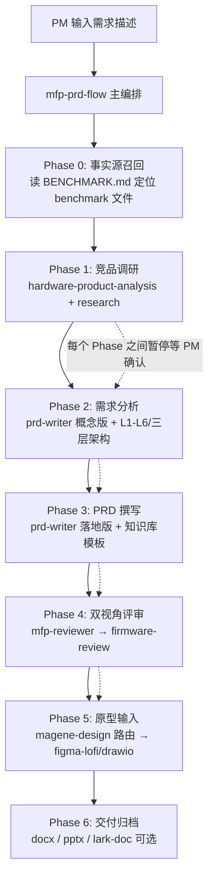

# MFP 执行方案：收敛为 Claude Code 原生工作流

> 文档状态：待执行
> 版本：v1.0
> 日期：2026-08-13
> 前置文档：`docs/2026-08-13-MFP-PRD.md`（MFP 产品需求初稿）
> 前置决策：**MFP 为个人使用** → 不部署、不做团队共享、Web 应用冻结

---

## 1. 决策记录

### 1.1 形态决策

| 候选形态 | 结论 | 理由 |
|---|---|---|
| Web 工作台产品（Next.js + D1 部署） | ❌ 放弃 | 个人使用无共享需求；部署后无法访问本地文件，知识必须打包进 repo，产生第二个事实源 |
| 本地 `npm run dev` Web 应用 | ❌ 放弃 | 能读本地文件，但为个人使用维护应用壳 + AI API 配置，投入产出比过低 |
| **Claude Code 原生工作流（Agent + Skill 编排）** | ✅ 选定 | 天然读本地文件；模型走 cc-switch 当前端点（现 Claude Code 所用端点原样复用），零配置、零部署、零运维 |

### 1.2 两个原始顾虑的解法

- **"怎么访问本地文件"**：Claude Code 进程在本机运行，直接读取 `~/Projects/Magene_PM_Workspace` 全部文件，无需任何同步机制。
- **"用哪个大模型"**：本机通过 cc-switch 管理模型端点（`~/.cc-switch`）。Claude Code 用哪个端点，MFP 工作流就用哪个，无需在 MFP 中配置任何 API key。

### 1.3 核心原则

1. **workspace 是唯一事实源（SSOT）**：`Magene_PM_Workspace` 的知识库、规范、BENCHMARK 索引为权威来源；MFP 通过软链引用，不复制、不持有第二份。
2. **Skill 尽量用本地已安装的成熟 skill**：全流程仅新建 1 个 skill（固件双视角评审），其余复用现有。
3. **产出即文件**：markdown + 单文件 HTML，浏览器直接打开，不依赖应用壳。
4. **不编造**：所有生成内容遵守 `.ai_global_profile.md` 的事实边界；AI 产出不得自动升级为 benchmark。

---

## 2. 目标架构

### 2.1 目录结构（改造后）

```
MageneFirmwarePlayground/
├── CLAUDE.md                        ← 唯一规则入口（薄，引用其余文件）
├── AGENTS.md                        ← Codex 等其他工具入口，内容与 CLAUDE.md 一致指向
├── .ai_global_profile.md            ← 软链 → workspace 同名文件（单一行为大脑）
├── .claude/
│   ├── agents/
│   │   ├── mfp-prd-flow.md          ← 主编排 Agent（调研→分析→PRD→评审→原型输入）
│   │   └── mfp-reviewer.md          ← 评审编排 Agent（研发/QA 双视角并行 + 汇总）
│   └── skills/
│       └── firmware-review/         ← ★ 唯一新建 skill（固件双视角评审）
├── skills/                          ← 全部软链 → workspace/.agents/skills/*
│   ├── magene-design → ...
│   ├── figma-lofi-prototype → ...
│   └── drawio-skill → ...
├── knowledge-base/                  ← 全部软链 → workspace 对应目录（不再有实体副本）
│   ├── 03_标准与规范 → ...
│   ├── 07_知识库 → ...
│   └── 08_知识图谱 → ...
├── docs/                            ← 保留 MFP-PRD 与本执行方案等文档
├── output/                          ← 需求工作包产出区（每需求一个目录）
│   └── {需求名}/
│       ├── 00-竞品调研.md
│       ├── 01-需求分析.md
│       ├── 02-PRD.md
│       ├── 03-评审意见.md
│       ├── 03-评审报告.html          ← 单文件 HTML（Tailwind CDN + 原生 JS）
│       └── 04-原型输入.md
├── app/ worker/ db/ drizzle/ ...    ← Web 脚手架：冻结留档，不投入
└── （design/ 目录并入 docs/ 或删除，见 Step 1）
```

### 2.2 工作流数据流



---

## 3. 执行步骤

### Step 1：清理去重 + 软链化（预计 15 分钟）

目标：消灭所有复制副本，建立单一事实源。

| # | 操作 | 说明 |
|---|---|---|
| 1.1 | `design/2026-08-13-MFP-PRD.md` 与 `docs/2026-08-13-MFP-PRD.md` 内容相同，删除 `design/` 下副本 | 本执行方案直接存入 `docs/`（或保留 design/ 作为设计文档区，二选一，避免再次出现双份） |
| 1.2 | 删除 `skills/magene-design`、`skills/figma-lofi-prototype`、`skills/drawio-skill` 实体目录，改软链到 `~/Projects/Magene_PM_Workspace/.agents/skills/*` | `ln -s` 三个链接 |
| 1.3 | 删除 `knowledge-base/` 下实体内容，改软链到 workspace 的 `03_标准与规范`、`07_知识库`、`08_知识图谱` | workspace 知识页更新后 MFP 自动生效 |
| 1.4 | `.ai_global_profile.md` 改软链到 workspace 同名文件 | 行为规范单一维护点 |
| 1.5 | git commit，标注"去重 + 软链化，workspace 成为 SSOT" | 留下回滚点 |

**注意**：软链后原 AGENTS.md 中的知识库相对路径仍然可用（软链对路径透明），但需逐条核对 AGENTS.md 引用的文件在 workspace 中都存在；失效引用改为"来源线索"标注。

### Step 2：规则入口 + Agent 编排层（预计 1-2 小时）

#### 2.1 CLAUDE.md（新建，薄入口）

内容结构：
1. 项目定位一句话：MFP = 迈金固件 PM 个人工作流（Claude Code 原生）
2. 强制先读：`.ai_global_profile.md`（行为规范）→ `knowledge-base/07_知识库/00_索引/知识库总索引.md`（知识入口）→ workspace 的 `BENCHMARK.md`（事实源索引）
3. 触发词映射表（见 2.2）
4. 产出规范：输出到 `output/{需求名}/`，命名规则、单文件 HTML 约定
5. 红线：不编造、AI 产出不升 benchmark、冲突即停问

#### 2.2 两个编排 Agent

**`.claude/agents/mfp-prd-flow.md`**（主编排）

- 触发词："开始需求 / 写PRD / MFP 流程"
- 职责：按 Phase 0→6 顺序编排，**每个 Phase 之间暂停等待 PM 确认**（沿用 prd-generator 的交互节奏）
- 关键规则：
  - Phase 0 必须先读 BENCHMARK.md，仅以 benchmark 状态文件为事实源；draft 仅参考方向；superseded 回溯须标注"来自废弃版本，待确认"
  - 每个 Phase 声明调用的 skill 与输入/输出文件
  - 复杂需求（跨端/OTA/多传感器并发）在进入 PRD 前强制先产出对象字段清单 + 状态-事件-操作矩阵（模板取自 `knowledge-base/03_标准与规范/`）

**`.claude/agents/mfp-reviewer.md`**（评审编排）

- 触发词："评审PRD / 固件评审"
- 职责：接收 PRD 路径，并行发起研发视角 + QA 视角评审（调用 firmware-review skill 的两个模式），汇总生成 `03-评审报告.html`
- HTML 要求（沿用 prd-generator 标准）：顶部统计卡片、🔴严重→🟡建议→🟢确认排序、问题卡片可展开、双视角交叉命中醒目标注

### Step 3：新建 firmware-review skill（唯一新建项，预计 2-3 小时）

位置：`.claude/skills/firmware-review/`

**底料来源**：
- prd-generator 的 `dev-review` / `qa-review` skill（现成的双视角骨架与输出格式）
- workspace `05_AI协作评测/` 的 magene-prd-reviewer 评测数据（评审质量基准）

**在底料之上叠加的固件专项检查**：

| 检查维度 | 研发视角 | QA 视角 |
|---|---|---|
| 三层架构完整性 | 物理层/协议层/App 层是否按需写清；协议是否明确到 ANT+ Profile / BLE GATT / FIT | 每层需求是否可测试、有无验收出口 |
| 固件典型陷阱 | 断连回连、断电保护、OTA 中断恢复、低电量、多设备并发、重启状态恢复 | 上述每个异常路径是否有对应测试场景 |
| 状态机 | 状态-事件-操作矩阵是否闭环、有无悬空状态 | 状态覆盖度、边界值、非法跳转 |
| SSOT 一致性 | 是否引用了 superseded 文档而未标注 | 需求与 benchmark 冲突项清单 |
| 可测试性 | — | 不可测试描述（"体验流畅"类）逐条点名 |

输出：`03-评审意见.md`（双视角合并，标注交叉命中）+ 供 mfp-reviewer 汇总的 HTML。

### Step 4：Web 应用冻结（预计 5 分钟）

- git tag `web-baseline-20260813` 留档
- README.md 顶部加一段："Web 应用骨架已冻结；团队共享需求出现时解冻，届时知识同步方案另议"
- 不删除 `app/` `worker/` `db/` 等文件，仅停止投入

### Step 5：试跑校准（预计半天）

选一个真实需求跑通 Phase 0→5 全流程，校准各 Phase 提示词与暂停节奏。

候选试点（按复杂度递增）：
1. 轻量：`01_工作台/专项PRD` 中某个 draft 专项的评审（直接测 Phase 4）
2. 中等：星环 2.0（PV3.3）某个待办功能走完整流程
3. 校准动作：把试跑暴露的问题回写进 Agent/Skill 定义，形成 v1.1

---

## 4. 成熟 Skill 映射表（复用清单）

| 阶段 | 复用 Skill | 来源 | 替代了 prd-generator 的 |
|---|---|---|---|
| Phase 0 需求脑暴（可选） | `brainstorming` | 全局已装 | — |
| Phase 1 竞品调研 | `hardware-product-analysis` + `research` | 全局已装 | `web-research` |
| Phase 2 需求分析 | `prd-writer`（概念版模式） | `~/.agents/skills/prd-writer` | `requirements-analysis` |
| Phase 3 PRD 撰写 | `prd-writer`（落地版模式） | 同上 | `prd-writer`（项目版） |
| Phase 4 双视角评审 | `firmware-review` ★新建 | MFP 本地 | `dev-review` + `qa-review` |
| Phase 4 评审报告 HTML | 编排 Agent 内置模板 | — | `pre-review-html` |
| Phase 5 原型输入 | `magene-design` → `figma-lofi-prototype` / `drawio-skill` | workspace 软链 | —（prd-generator 无此能力，MFP 增量） |
| Phase 6 交付归档 | `docx` / `pptx` / `lark-doc` | 全局已装 | — |

结论：**新建 1 个 skill，复用 10+ 个成熟 skill。**

---

## 5. 纪律规则（写入 CLAUDE.md 与 Agent 定义）

1. **召回顺序**：任何需求开工前，先读 BENCHMARK.md → 定位 benchmark 文件 → 再动手。
2. **状态机纪律**：benchmark（事实源）> draft（仅参考方向）> superseded（回溯须标注待确认）> reference（仅背景）> AI 产出（永不为事实源）。
3. **索引与实际不一致 → 停止并询问 PM**，不得自行猜测。
4. **待确认优先于编造**：信息缺口会改变范围/流程/交互时提问，其余标"待确认"。
5. **AI 产出不自动升级**：生成物先落 `output/` 草稿区；升级为 benchmark 只能由 PM 人工决定并更新 BENCHMARK.md。
6. **产出命名**：`output/{需求名}/00~04-*`；评审 HTML 单文件、Tailwind CDN、浏览器直开。

---

## 6. 验收标准

- [ ] 项目内无任何知识库/skill/行为规范的实体副本，全部为软链，且软链全部有效
- [ ] `design/` 与 `docs/` 无双份文档
- [ ] 说一句"开始需求：XX"，mfp-prd-flow 能按 Phase 推进且每步暂停等确认
- [ ] Phase 0 能正确引用 BENCHMARK.md 中的 benchmark 文件路径
- [ ] firmware-review 能对一份真实 PRD 输出双视角评审 + HTML 报告，且包含固件专项检查（断连/断电/OTA/状态机）
- [ ] 试跑需求的产出包结构完整（00-竞品调研 → 04-原型输入）
- [ ] Web 应用已打 tag 冻结，README 标注清楚

---

## 7. 风险与待确认

| # | 风险/问题 | 影响 | 处理 |
|---|---|---|---|
| 1 | workspace 路径为绝对路径，MFP 软链依赖其位置不变 | workspace 移动/改名则软链全断 | 个人单机可接受；若移动需重建软链（可写一个 `scripts/relink.sh` 备用） |
| 2 | 全局 skill 数量庞大，触发词可能互相干扰（如 `prd-writer` 全局版与 prd-generator 项目版同名） | skill 路由错配 | CLAUDE.md 中显式声明本项目各阶段指定的 skill；必要时在 Agent 定义里写死 skill 名 |
| 3 | `hardware-product-analysis` 面向硬件拆解，竞品"功能方案"调研可能不完全贴合 | Phase 1 质量不稳 | 试跑时校准；不贴合则补充一个薄编排提示，仍不新建 skill |
| 4 | BENCHMARK.md 目前仅一个 benchmark（码表通用功能整合 V2），多数专项还是 draft | Phase 0 召回经常落到 draft | 属 workspace 侧定稿节奏问题，MFP 如实标注 draft 状态即可 |
| 5 | 软链后 git 对软链的追踪在跨机器时无效 | 无（个人单机使用） | 不处理；如未来多机使用再改为实体 + 同步脚本 |

---

## 8. 变更记录

| 版本 | 日期 | 变更内容 |
|---|---|---|
| v1.0 | 2026-08-13 | 初版：确定个人使用 → Claude Code 原生工作流；五步执行方案 |
