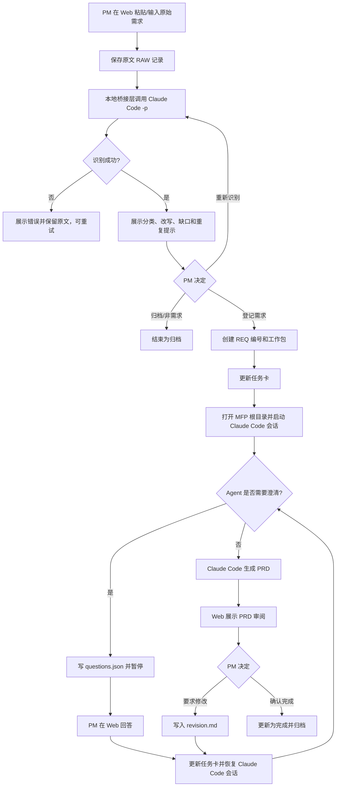

# MFP 本地产品经理 Agent：MVP 需求 PRD

> **文档类型**：MVP 落地需求文档（PRD）
> **对应实施方案**：`design/2026-08-27-MFP-本地产品经理Agent实施方案.md`
> **文档版本**：v2.0
> **范围**：MVP / Claude Code 单运行时
> **最后更新**：2026-08-27

## 1. 产品定义

MFP（Magene Firmware Playground）MVP 是运行在 PM 自己电脑上的本地产品经理工作台。它用 Web 界面收集和识别原始需求，用本地桥接层管理工作包，再调用 PM 已安装并登录的 Claude Code 完成澄清、分析和 PRD 生成。

本期不做 Teambition 自动抓取，不做 Codex/Trae 适配，不绑定 MFP 自己的 AI API Key。MVP 只验证一条可日常使用的闭环：

```text
手动输入/粘贴原始需求
  → Web 端发起识别
  → Claude Code 非交互识别并返回结构化结果
  → PM 确认登记
  → 打开 MFP 指定目录并自动启动 Claude Code 会话
  → Claude Code 澄清需求、生成 PRD
  → Web 审阅、要求修改或确认完成
```

### 1.1 MVP 要解决的问题

- 原始客户问题没有稳定的收件箱和需求编号；
- 需求识别、正式登记、澄清、PRD 和完成状态分散在聊天中；
- Agent 是否读取了 `AGENTS.md`、benchmark 和正确工作包无法确认；
- 会话关闭或换终端后，问题、回答和 PRD 版本容易丢失；
- 不熟悉 Git 和命令行的 PM 不知道应该在哪个目录启动 Claude Code。

### 1.2 MVP 成功标准

PM 不需要使用 Git，不需要手动拼接复杂 Prompt，只需：

1. 在 Web 中粘贴一条原始需求；
2. 查看 Claude Code 的识别和改写结果；
3. 确认登记；
4. 点击“在 Claude Code 中开始”；
5. 在 Web 查看 Agent 提出的问题并回答；
6. 查看 PRD、要求修改或确认完成。

## 2. 产品形态与边界

### 2.1 推荐形态：本地桌面应用

MVP 推荐使用 **Tauri + React**：

```text
MFP 桌面应用
├── Web UI：原始需求、需求池、问题、PRD、状态
├── 本地桥接层：文件读写、Claude CLI 检查、进程启动、日志刷新
├── MFP 工作区：AGENTS.md、knowledge-base、requests、output
└── Claude Code：PM 自己的本地 Agent 执行环境
```

普通浏览器页面不能直接可靠地打开任意本地目录或启动终端进程。若坚持使用浏览器版 Web，则必须额外安装本地 Helper/Bridge；这会增加安装、权限和跨平台适配成本。因此 MVP 采用本地桌面壳，Web 只是应用内的操作界面。

### 2.2 本期范围

| 范围 | MVP 决策 |
|---|---|
| 输入方式 | 手动输入、粘贴 IM/聊天文本 |
| 识别执行 | 本地调用 Claude Code `-p/--print` |
| 后续执行 | 本地启动 Claude Code 交互会话 |
| Agent | 仅 Claude Code |
| 知识库 | 读取现有 MFP 项目规则和本地 benchmark，默认只读 |
| 数据 | 本地文件为主，可用 SQLite 做列表索引 |
| 终端 | macOS、Windows |
| 用户 | 单机单用户，不做团队账号和云同步 |
| 输出 | 需求记录、问题/答案、工作日志、Markdown PRD |

### 2.3 明确不做

- Teambition 自动抓取；
- Codex、Trae 或其他 Agent 运行时适配；
- MFP 自建模型服务或统一 API Key；
- 浏览器直接控制任意外部终端；
- 自动登记正式需求；
- 自动升级 benchmark 或修改原始知识库；
- 飞书发布、团队协作、权限系统、KPI 看板；
- 附件 OCR、复杂网页抓取和批量需求导入。

## 3. 用户与核心场景

目标用户是迈金固件产品经理：能够安装并登录 Claude Code，但不希望学习 Git、工作区结构和命令行参数。

PM 从客户 IM 中复制一段问题到 MFP。MFP 保存原文，调用本地 Claude Code 判断这是否属于需求，并给出功能需求改写。PM 确认后，MFP 创建需求工作包，打开 MFP 根目录的 Claude Code 会话。Claude Code 读取 `AGENTS.md`、任务卡和 benchmark，发现缺少机型范围后把问题写回工作包并暂停。PM 在 Web 回答，点击继续；Claude Code 生成 PRD。PM 审阅并要求补充后，Claude Code 生成新版本，PM 最终确认完成。

## 4. 核心用户流程



## 5. Web 与 Claude Code 的职责

| 阶段 | Web / MFP 操作台 | Claude Code |
|---|---|---|
| 原始需求 | 输入、保存原文、展示来源和时间 | 通过 `-p` 读取原文并输出识别 JSON |
| 需求识别 | 展示分类和改写，等待 PM 决定 | 判断是否为需求、改写功能需求、标记缺口 |
| 正式登记 | 生成需求编号、创建工作包、更新状态 | 不得自行登记正式需求 |
| 启动 | 检查 CLI、工作目录、规则文件并启动会话 | 从 MFP 根目录读取 `AGENTS.md`、任务卡和 benchmark |
| 澄清 | 展示问题、收集 PM 答案、点击继续 | 将问题写入工作包并暂停，读取答案后继续 |
| PRD | 展示 Markdown、记录修改意见、完成确认 | 写入需求分析、PRD、版本差异和工作日志 |
| 知识库 | 展示引用和版本，不直接改事实源 | 仅按规则读取 benchmark，不把草稿写入知识库 |

Web 不需要展示模型内部推理；它只展示可操作的结论、依据、问题、状态和产物。

## 6. MVP 功能清单

```text
MFP MVP
├── 🔴 F-01 原始需求录入
│   ├── 手动输入/粘贴文本
│   ├── 保存原文
│   └── 创建 RAW 编号
├── 🔴 F-02 Web 端需求识别
│   ├── 调用 Claude Code -p
│   ├── 分类与功能需求改写
│   ├── 信息缺口
│   └── 重复/冲突候选提示
├── 🔴 F-03 需求池与正式登记
│   ├── PM 确认/归档/重新识别
│   ├── 创建 REQ 编号和工作包
│   └── 展示状态、下一步和更新时间
├── 🔴 F-04 Claude Code 启动与会话管理
│   ├── 检查本机 Claude CLI 和登录状态
│   ├── 打开 MFP 根目录
│   ├── 自动启动新会话
│   ├── 按需求恢复指定会话
│   └── 失败时复制任务卡/打开目录
├── 🔴 F-05 澄清问答与断点恢复
│   ├── Agent 问题写回工作包
│   ├── Web 收集 PM 答案
│   └── 继续同一需求工作流
├── 🔴 F-06 PRD 生成、审阅与修改
│   ├── Markdown 预览
│   ├── 修改意见
│   ├── 版本记录
│   └── PM 确认完成
└── 🟡 F-07 运行记录与诊断
    ├── 启动日志
    ├── CLI 错误
    └── 工作包完整性检查
```

## 7. 功能详细要求

### 7.1 F-01 原始需求录入

**入口**：需求池顶部“新建原始需求”。

**输入字段**：

| 字段 | 必填 | 规则 |
|---|---:|---|
| 原始文本 | 是 | 1–20,000 字符；超出时提示分段 |
| 来源说明 | 否 | 例如“客户 IM”“会议记录”“个人想法” |
| 来源链接 | 否 | 仅本地保存，不做自动访问 |
| 创建人 | 自动 | 当前本机用户 |

提交后立即写入：`intake/RAW-YYYYMMDD-NNN/source.md`。即使后续识别失败，原文也不能丢失。

### 7.2 F-02 Web 端需求识别

Web 点击“开始识别”后，由本地桥接层在 MFP 根目录执行 Claude Code 非交互命令。推荐调用契约：

```text
claude -p <识别指令> \\
  --output-format json \\
  --json-schema <识别结果 Schema>
```

识别指令要求 Claude Code：

1. 先读取 `AGENTS.md` 和 MFP 的知识库入口；
2. 读取指定的 `source.md`；
3. 输出结构化识别结果，不修改 benchmark；
4. 将无法确认的内容标记为“待确认”；
5. 不创建正式需求，不生成最终 PRD。

识别结果至少包含：

```json
{
  "category": "feature|bug|consultation|research|invalid|duplicate_candidate",
  "title": "功能需求候选标题",
  "rephrased_requirement": "可执行的功能需求描述",
  "user_and_scenario": "用户与场景",
  "scope_candidates": ["涉及端/机型/对象"],
  "known_constraints": ["已有约束"],
  "missing_information": ["待 PM 确认的问题"],
  "evidence": [{"path": "知识库文件路径", "reason": "引用原因"}],
  "duplicate_candidates": [],
  "confidence": "high|medium|low"
}
```

识别结果展示后必须等待 PM 选择：“登记为正式需求”“归档”或“重新识别”。Agent 的分类和改写是建议，不得自动转成正式需求。

### 7.3 F-03 需求池与正式登记

PM 确认登记后：

1. 生成稳定编号 `REQ-YYYYMMDD-NNN`；
2. 创建 `requests/REQ-.../` 工作包；
3. 将原始输入、识别结果、PM 确认内容写入工作包；
4. 生成第一版 `agent-task.md`；
5. 状态改为“待启动”。

需求池至少展示：标题、需求编号、来源、当前状态、下一步、最近更新时间、PRD 版本。

### 7.4 F-04 Claude Code 启动与会话管理

#### 7.4.1 启动前检查

点击“在 Claude Code 中开始”后，MFP 依次检查：

- `claude` 命令是否存在；
- `claude --version` 是否能返回；
- 当前用户是否已完成 Claude Code 登录；
- MFP 根目录是否存在；
- `AGENTS.md`、`.ai_global_profile.md`、`knowledge-base/01_事实源/BENCHMARK.md` 是否存在；
- 当前需求的 `agent-task.md` 是否存在且可读；
- 当前需求工作包和 `output/` 是否可写。

检查失败时保留需求和任务卡，给出“重试检查”“打开目录”“复制启动指令”三个选项。

#### 7.4.2 自动打开指定目录并开启会话

**答案：需要，而且这是 MVP 的核心体验。**

MFP 不能只把 Prompt 复制到剪贴板。启动器应使用进程 API 设置 `cwd` 为 MFP 项目根目录，并打开外部终端窗口启动 Claude Code。启动时向会话传入任务卡路径和本轮目标，例如：

```text
请先读取 /Users/.../MageneFirmwarePlayground/AGENTS.md，
然后读取当前任务卡：/Users/.../MageneFirmwarePlayground/requests/REQ-.../agent-task.md。
按任务卡执行本阶段工作。遇到关键缺口时，把问题写入
requests/REQ-.../questions.json，并暂停，不要只留在聊天窗口。
```

实际进程调用逻辑应等价于：

```text
可执行文件：claude
工作目录：MFP 项目根目录
参数：--name "MFP · REQ-..." <本轮启动指令>
```

首次点击创建新会话并保存 session id；“继续”操作使用保存的 session id 恢复会话。MVP 不要求把 Claude Code 聊天内容嵌入 Web，外部终端作为 Agent 工作现场，Web 通过工作包文件刷新进度。

#### 7.4.3 跨平台行为

| 平台 | MVP 行为 |
|---|---|
| macOS | 打开 Terminal；可在设置中选择 iTerm2 作为终端 |
| Windows | 优先打开 Windows Terminal；不可用时回退到 PowerShell |
| 共同点 | 进程 `cwd` 固定为 MFP 根目录，任务卡用绝对路径传入 |

### 7.5 F-05 澄清问答与断点恢复

Claude Code 发现信息不足时必须：

1. 将问题写入 `questions.json`；
2. 将状态写为“待 PM 回答”；
3. 在 `run-log.ndjson` 记录原因和时间；
4. 停止继续生成 PRD。

Web 轮询或文件变更监听到新问题后，在需求详情页展示问题。PM 填写答案并点击“继续”，MFP 更新问题状态、刷新 `agent-task.md`，再通过 `claude --resume <session-id>` 恢复会话。

如果原会话不可恢复，MFP 允许创建新会话；新会话仍从 MFP 根目录启动，并读取完整工作包，因此不依赖聊天历史。

### 7.6 F-06 PRD 生成、审阅与修改

Claude Code 在信息足够并完成必要阶段后，将 PRD 写入：

```text
output/{需求名}/02-PRD.md
```

Web 提供 Markdown 预览和以下操作：

- “提交修改意见”：写入 `revision.md`，状态改为“修改中”；
- “要求 Claude Code 修改”：启动/恢复会话，读取当前版本和修改意见；
- “确认完成”：状态改为“完成”；
- “打开产出目录”：打开本地文件夹。

MVP 不要求 Web 内置富文本编辑器；PRD 真源是本地 Markdown 文件。

## 8. 工作包与数据结构

```text
MFP 项目根目录/
├── AGENTS.md
├── .ai_global_profile.md
├── knowledge-base/
├── intake/
│   └── RAW-YYYYMMDD-NNN/
│       ├── source.md
│       └── classification.json
├── requests/
│   └── REQ-YYYYMMDD-NNN/
│       ├── request.json
│       ├── agent-task.md
│       ├── questions.json
│       ├── evidence.md
│       ├── revision.md
│       ├── session.json
│       ├── run-log.ndjson
│       └── artifacts/
└── output/
    └── {需求名}/
        └── 02-PRD.md
```

`session.json` 只记录 Claude Code 会话标识、最后启动时间、运行状态和 CLI 版本，不记录 API Key。

### 8.1 状态清单

```text
待识别 → 待 PM 确认 → 待登记 → 待启动 → 处理中
处理中 → 待 PM 回答 → 处理中
处理中 → 待审阅 → 修改中 → 待审阅
待审阅 → 完成
待 PM 确认 → 归档
```

Agent 只能写入建议状态、问题、日志和产物；正式登记、归档、完成由 PM 在 Web 中确认。

## 9. 非功能需求

| 类别 | MVP 要求 |
|---|---|
| 平台 | macOS、Windows 11 优先；后续再验证更早版本 |
| 易用性 | PM 不需要 Git；首次配置只需选择工作区、安装并登录 Claude Code |
| 数据安全 | 原文、问题、答案和 PRD 默认只存本机；MFP 不保存 API Key |
| 可恢复 | Web 关闭、终端关闭后，可从工作包恢复状态；新会话可继续 |
| 性能 | 原始文本保存应即时完成；识别过程展示进行中状态；超时可重试 |
| 可诊断 | 保存 CLI 命令摘要、退出码、错误摘要和时间；不保存敏感凭据 |
| 权限 | 首次启动明确请求访问 MFP 工作区和启动终端所需权限 |

## 10. 验收标准

- [ ] PM 可以在 Web 输入或粘贴 1–20,000 字符的原始需求，提交后原文不会丢失。
- [ ] MFP 能调用本机 Claude Code `-p`，返回分类、功能需求改写、缺口、依据和置信度。
- [ ] 识别失败时保留原始记录，并提供重试，不生成伪造结果。
- [ ] PM 未确认时不会创建正式需求；确认后生成 REQ 编号、工作包和任务卡。
- [ ] 点击“在 Claude Code 中开始”时，能打开外部终端并以 MFP 根目录为 `cwd` 启动新会话。
- [ ] 启动指令要求 Claude Code 先读取 `AGENTS.md` 和当前任务卡；任务卡包含绝对路径和本轮目标。
- [ ] Claude Code 发现缺口后，Web 能展示 `questions.json` 中的问题；PM 回答后能恢复同一会话或创建可恢复的新会话。
- [ ] Claude Code 能将 PRD 写入指定的 `output/{需求名}/02-PRD.md`，Web 能预览。
- [ ] PM 可以提交修改意见并获得新版本；未点击“确认完成”前，需求不会自动完成。
- [ ] 关闭 Web 或终端后，重新打开 MFP 仍能从本地工作包显示状态、问题和已有产物。
- [ ] Claude Code 未安装、未登录、目录不可写或规则文件缺失时，Web 给出具体原因和降级操作。

## 11. MVP 实施顺序

1. **P0 协议验证**：手动创建一个工作包，验证 `agent-task.md`、`questions.json`、`session.json`、`run-log.ndjson` 和 PRD 写回。
2. **P0 Claude Code 适配**：验证 `claude -p` 结构化识别、外部终端启动、指定 `cwd`、新会话和 `--resume`。
3. **P1 本地桌面壳**：完成工作区选择、状态检查、原始需求录入、需求池和需求详情。
4. **P1 闭环**：完成识别确认、启动会话、问题/回答、PRD 预览、修改和完成确认。
5. **P1 稳定性**：补充错误处理、文件监听、日志诊断、macOS/Windows 安装包和真实 PM 试用。

## 12. 待确认项

- [ ] macOS 默认使用 Terminal 还是允许 PM 选择 iTerm2；影响启动器实现。
- [ ] Windows 是否统一使用 Windows Terminal；影响安装包检测和回退逻辑。
- [ ] Claude Code 的本地登录检查采用 `claude doctor`、一次试运行，还是仅检查 CLI；影响首次配置体验。
- [ ] MFP 是否继续保留现有 `output/{需求名}/00–05` 全阶段产出，还是 MVP 先只要求 `02-PRD.md`；影响工作包映射。

## 13. MVP 完成定义

一个不熟悉 Git 的 PM，能够在自己的 macOS 或 Windows 电脑上，仅通过 MFP Web 完成：手动输入原始需求 → 查看识别结果 → 确认登记 → 自动打开 MFP 指定目录并启动 Claude Code → 回答澄清问题 → 查看和修改 PRD → 手动确认完成。所有关键状态、问题和产物都能从本地工作包恢复，且不依赖某次聊天窗口是否仍然打开。
