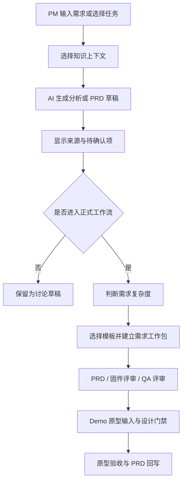

# MFP（MageneFirmwarePlayground）产品需求文档初稿

> 文档状态：初稿 / 待确认  
> 产品名称：MFP（MageneFirmwarePlayground）  
> 版本：v0.1  
> 日期：2026-08-13  
> 目标用户：迈金室外固件产品经理及相关研发、测试、设计成员

## 1. 一句话定义

MFP 是一个面向迈金固件产品团队的知识驱动型产品工作台：让 PM 从已确认的知识库资料中选择上下文，通过 AI 生成可追溯的需求分析、PRD 和固件评审结果，并逐步扩展为可复制的需求工作流系统。

## 2. 背景与问题

当前迈金 PM 工作区已经积累了知识库、历史 PRD、`BENCHMARK` 单一事实来源、对象与字段模板、状态—事件—操作矩阵、设计系统和原型验收清单，但使用方式仍较依赖个人经验：

- PM 需要手动判断应该查哪些资料、使用哪个模板和调用哪些 Skill；
- 同一需求的分析、PRD、状态矩阵、原型输入和评审结果容易分散；
- 通用 AI 生成结果可能遗漏固件领域的断连、断电、OTA、协议、FIT、功耗和多端状态问题；
- 历史版本、draft、superseded、reference 与 AI 产出之间需要人工辨别；
- 工作区知识和规范尚未被编排成一条可复制的生产流程。

## 3. 产品目标

### 3.1 本期目标

1. 提供一个可运行的 MFP 工作台 MVP。
2. 支持从知识库条目中检索和选择上下文。
3. 支持基于选定上下文生成中文产品分析或 PRD 草稿。
4. 在生成结果中保留来源路径，明确结果只是讨论草稿。
5. 复用当前工作区的 Magene 固件术语、三层架构和“不编造”原则。
6. 为后续需求类型路由、PRD 评审、原型输入和验收流程保留扩展边界。

### 3.2 后续目标

- 自动判断轻量迭代、普通功能、复杂跨端功能和探索型需求；
- 自动定位 `BENCHMARK` 与相关知识专题；
- 自动选择轻量或复杂 PRD 模板；
- 增加固件研发评审、QA 可测试性评审和跨端状态评审；
- 形成一个需求工作包，集中保存分析、PRD、评审、Demo 原型输入和验收记录；
- 接入 `magene-design` 设计门禁和原型验收流程。

## 4. 非目标

- 本期不替代现有知识库、历史归档、`BENCHMARK.md` 或正式设计系统。
- 本期不自动修改原始知识库和历史 PRD。
- 本期不把 AI 生成结果自动升级为 benchmark 或正式事实。
- 本期不强制所有需求使用固定八章节 PRD。
- 本期不实现完整的研发任务管理、代码管理或项目排期系统。
- 本期不在没有确认依据时自动补充协议、硬件能力、实体按键或恢复逻辑。

## 5. 用户与核心场景

### 5.1 主要用户

| 用户 | 主要目标 | 核心诉求 |
|---|---|---|
| 固件 PM | 写需求、查基线、做评审 | 快速找到可信上下文，减少遗漏和返工 |
| 固件研发 | 判断可实现性和风险 | 看到明确的状态、协议、兼容性和边界 |
| 测试人员 | 准备测试和验收 | 需求可测试，异常和状态有明确出口 |
| 设计/原型人员 | 根据需求产出交互方案 | 页面、状态、操作和设计系统边界清晰 |

### 5.2 典型场景

1. PM 选择“版本与机型”和“固件升级”资料，生成 OTA 需求评审。
2. PM 选择“传感器体系”和“智联助手”资料，生成外设联动功能 PRD 初稿。
3. PM 输入一个新需求，系统判断是否需要对象字段清单和状态矩阵。
4. PM 对已有 PRD 发起固件专项评审，获得风险、待确认项和验收建议。
5. PM 在进入原型前，确认目标端、机型、页面状态和设计系统。

## 6. 本期 MVP 范围

### P0：知识上下文工作台

- 展示可用知识条目；
- 按专题分类浏览；
- 按标题、摘要和标签搜索；
- 选择最多三份资料作为生成上下文；
- 显示已选上下文；
- 支持移除和替换已选资料。

### P0：AI 产品助手

- 输入自然语言任务；
- 通过 API 将任务和选定资料发送给模型；
- 默认使用中文输出；
- 要求模型基于提供资料回答，不得编造；
- 涉及功能时按目标人群、硬件/物理层、固件/协议通信层、App 业务交互层、异常与断电保护、验收标准组织；
- 关键结论标注来源路径；
- 未配置模型服务时提供明确的配置提示，不修改原始资料；
- 生成失败时提供可理解的错误反馈。

### P0：产品工作台界面

- 工作台总览；
- 知识库浏览入口；
- 版本与机型入口占位；
- 生成记录入口占位；
- 当前工作区和同步状态展示；
- 生成结果展示和复制操作；
- 响应式布局。

### P1：工作流编排

- 需求类型识别；
- 轻量/复杂模板选择；
- benchmark 定位；
- 输入缺口检查；
- 阶段暂停和继续；
- 统一下一步提示。

### P1：需求工作包

- 需求分析；
- 对象与字段清单；
- 状态—事件—操作矩阵；
- 正式 PRD；
- 评审报告；
- Demo 原型输入；
- 原型验收记录。

### P2：领域评审与设计闭环

- 固件研发评审；
- QA 可测试性评审；
- 跨端状态评审；
- `magene-design` 设计门禁；
- 原型验收和 PRD 回写。

## 7. 产品流程

## 8. 现有 MVP 基线

本次从 `MageneFirmwarePlayground` 的 Git HEAD 复制到 `MFP/` 的资产，作为实现基线：

| 能力 | 当前基线 |
|---|---|
| Web 应用 | Next.js / React / vinext 运行骨架 |
| 工作台页面 | `app/page.tsx`，包含知识条目筛选、上下文选择、任务输入和结果展示 |
| AI 接口 | `app/api/generate/route.ts`，支持 OpenAI Chat Completions 调用和无配置降级 |
| 身份能力 | `app/chatgpt-auth.ts`，提供可选或强制 ChatGPT 登录辅助函数 |
| 部署骨架 | Cloudflare Worker、Vinext、Sites hosting 配置 |
| 数据扩展 | Drizzle / D1 接入骨架，当前 schema 为空 |
| 测试 | `tests/rendered-html.test.mjs`，现有测试需在 MFP MVP 中重新核对页面基线 |

> 以上是代码基线判断，不代表所有能力已经完成产品化。界面中的知识数量、机型覆盖和协议数量当前属于展示数据，不能直接视为真实统计结果。

## 9. 产品规则

1. 生成结果必须优先使用当前工作区的 benchmark 和已确认知识。
2. 资料冲突、版本不一致和迈金独有机制不确定时，输出“待确认”。
3. 生成结果必须保留来源路径，便于回到原始文档核查。
4. 原始知识库默认只读，MFP 生成结果不能直接覆盖原始资料。
5. 轻量需求不强制建立完整对象和状态矩阵；复杂跨端需求原则上必须建立。
6. 进入原型阶段前必须明确目标端、机型、尺寸、页面状态和可执行操作。
7. 任何未确认的实体按键、协议、自动恢复、硬件能力和导航跳转不得由 MFP 自行补充。

## 10. 数据与对象草案

| 对象 | 关键字段 | 生命周期 | 备注 |
|---|---|---|---|
| KnowledgeSource | id、标题、路径、专题、类型、摘要、标签、状态 | 知识库维护 | 初期可由配置或索引提供 |
| GenerationTask | id、任务描述、创建时间、用户、状态 | 草稿→完成/失败 | 后续用于生成记录 |
| ContextSelection | task_id、source_id、选择顺序 | 任务期间 | 记录本次引用了哪些资料 |
| GenerationResult | task_id、标题、正文、来源、模型、错误 | 生成后保留 | AI 产出，不是事实基线 |
| RequirementWorkspace | id、名称、类型、阶段、关联 benchmark | 需求生命周期 | P1 工作包能力 |
| ReviewFinding | workspace_id、视角、等级、位置、问题、建议、状态 | 评审期间 | P2 领域评审能力 |

## 11. 状态与异常草案

| 状态 | 进入条件 | 用户可见反馈 | 下一步 |
|---|---|---|---|
| Ready | 工作台可用 | AI READY 或对应服务状态 | 选择资料并输入任务 |
| MissingContext | 未选资料或任务为空 | 提示补充上下文 | 选择资料/填写任务 |
| Generating | 已发起生成 | 显示处理中，避免重复提交 | 等待成功或失败 |
| Succeeded | 模型返回有效结果 | 展示结果和来源 | 复制、继续编辑或进入工作流 |
| ConfigurationRequired | 未配置模型服务 | 明确提示服务端配置要求 | 配置服务或使用界面草稿 |
| Failed | 模型请求失败或返回为空 | 显示可理解的失败信息 | 重试或调整任务 |
| NeedsConfirmation | 资料冲突或关键信息不足 | 展示待确认项和影响范围 | 回到原始资料或请求 PM/研发确认 |

## 12. 验收标准

### MVP 功能验收

- [ ] PM 能浏览知识条目并按专题筛选。
- [ ] PM 能按关键词搜索标题、摘要和标签。
- [ ] PM 能选择、替换和移除生成上下文。
- [ ] 未选择资料或未填写任务时，系统不会发起生成请求。
- [ ] 生成请求包含任务描述和选定资料的标题、路径、摘要。
- [ ] 生成结果展示来源路径。
- [ ] 未配置 AI 服务时，系统给出配置提示且不修改知识库。
- [ ] AI 调用失败时，系统展示失败反馈并允许用户重试。
- [ ] 工作台在桌面端和窄屏环境下保持可用。

### 质量与领域验收

- [ ] 生成提示包含“不编造”和“待确认”规则。
- [ ] 生成提示包含 Magene 固件三层架构要求。
- [ ] 生成提示包含异常、断电保护和验收标准要求。
- [ ] 后续工作流能区分轻量需求和复杂跨端需求。
- [ ] 复杂需求能关联对象字段、状态矩阵和原型验收。
- [ ] MFP 不把 AI 产出自动写入 benchmark。

## 13. 风险与待确认

| 风险/问题 | 影响 | 处理 |
|---|---|---|
| 当前知识条目仍以页面内静态数组为主 | 知识库更新不能自动同步 | P1 接入可读取的索引或知识源 |
| 当前选定上下文最多三份 | 复杂需求可能缺少必要资料 | 待确认是否改为按 token/优先级控制 |
| 当前 AI API 使用通用 Chat Completions | 可能需要适配正式 OpenAI 运行环境 | 待确认部署和模型调用标准 |
| 当前生成记录和用户身份未形成完整数据模型 | 无法可靠复用和审计历史生成 | P1 设计持久化方案 |
| 源项目 HEAD 的测试仍包含 starter 预览壳引用 | 复制后的测试基线可能与当前页面不一致 | MFP 首次验证时重写为工作台行为测试 |
| 知识库事实与路径可能继续变化 | 生成结果可能引用失效路径 | 引入索引校验和冲突阻断 |

## 14. 迭代优先级

### Phase 1：可用工作台

- 校正 MFP 品牌和产品文案；
- 让知识条目来自当前工作区索引，而不是硬编码展示数据；
- 完成生成状态、错误处理和结果复制；
- 建立最小可运行测试。

### Phase 2：需求工作流

- 增加需求类型判断；
- 接入 `BENCHMARK` 定位；
- 按轻量/复杂需求选择模板；
- 建立需求工作包和阶段状态。

### Phase 3：评审与原型闭环

- 固件专项评审；
- QA 可测试性评审；
- Demo 原型输入；
- `magene-design` 设计门禁；
- 原型验收与 PRD 回写。

## 15. 变更记录

| 版本 | 日期 | 变更内容 |
|---|---|---|
| v0.1 | 2026-08-13 | 基于 MageneFirmwarePlayground MVP 和当前 Magene PM 工作区规范形成初稿 |
