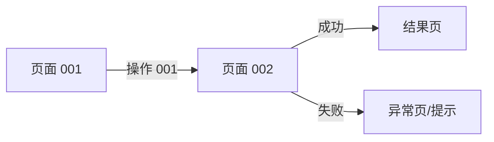

# Demo版PRD与原型输入规范

> Demo 版 PRD 是“专门用于生成原型的产品说明”，不替代正式 PRD。
> 正式 PRD 解决“产品要做什么”；Demo 版 PRD 解决“原型具体要画什么”。

## 1. 进入条件

生成 Demo 版 PRD 前，原则上应已有：

- 正式 PRD 或明确的轻量需求说明；
- 目标端：App、C706 或两端联动；
- 业务流程和关键异常流程；
- 对象/字段清单；
- 状态—事件—操作矩阵；
- 适用机型、固件/App 版本和国内/海外范围；
- 对应设计系统和页面尺寸约束。

如果以上内容缺失，Agent 先列出缺口。缺口不会改变页面范围时可以继续，并标记“待确认”；缺口会改变流程、页面或状态时必须先暂停生成。

## 2. 页面清单

| 页面 ID | 页面名称 | 目标端 | 入口 | 页面目的 | 关联需求 ID | 关联状态 ID | 页面类型 |
|---|---|---|---|---|---|---|---|
| PAGE-001 |  | App / C706 |  |  | REQ-001 | STATE-001 | 列表 / 详情 / 表单 / 进行中 / 结果 / 异常 |

## 3. 页面状态

每个页面至少说明默认状态；涉及异步、连接或任务时，补充进行中、成功、失败、空状态和不可用状态。

| 页面 ID | 状态 ID | 进入条件 | 页面展示 | 可执行操作 | 操作结果 | 退出/跳转 |
|---|---|---|---|---|---|---|
| PAGE-001 | UI-STATE-001 |  |  |  |  |  |

## 4. 页面内容与字段

| 页面 ID | 区域/组件 | 字段或文案 | 数据来源 | 显示条件 | 空值/超长处理 | 关联字段 ID |
|---|---|---|---|---|---|---|
| PAGE-001 | 顶部/列表/弹窗 |  |  |  |  | FIELD-001 |

## 5. 用户操作与反馈

| 操作 ID | 页面 ID | 操作入口 | 可操作条件 | 用户动作 | 系统行为 | 成功反馈 | 失败反馈 | 下一页面 |
|---|---|---|---|---|---|---|---|---|
| ACTION-001 | PAGE-001 |  |  |  |  |  |  |  |

## 6. 页面跳转



| 跳转 ID | 起始页面 | 触发操作/事件 | 条件 | 目标页面 | 返回行为 |
|---|---|---|---|---|---|
| NAV-001 | PAGE-001 | ACTION-001 |  | PAGE-002 |  |

## 7. 端到端联动

涉及 App 与 C706 时，只描述用户会看到或操作的节点：

```text
App 发起操作 → C706 确认/进行中 → C706 结果 → App 刷新结果
```

| 步骤 | 用户看到的端 | 用户动作/系统反馈 | 另一端同步结果 | 关联状态/操作 |
|---|---|---|---|---|
| 1 |  |  |  |  |

## 8. 原型约束

| 项目 | 要求 |
|---|---|
| 目标端 | App / C706 / 两端联动 |
| 设计规范 |  |
| 尺寸 | C706 默认 320 × 480 px；App 按对应设计规范 |
| 不允许自行假设 | 实体按键、协议、硬件能力、自动恢复、未确认页面 |
| 文案约束 | 短文案、状态不只依赖颜色、多语言宽度按设计规范校验 |

## 9. 需求—页面追踪

| 需求 ID | 页面/状态/操作 | 原型 Frame 或节点 | 验收 ID | 覆盖状态 |
|---|---|---|---|---|
| REQ-001 | PAGE-001 / UI-STATE-001 / ACTION-001 | 待补充 | AC-001 | 是 / 部分 / 否 |

## 10. 生成前检查

- [ ] 目标端和页面范围明确。
- [ ] 每个页面有入口和退出/跳转关系。
- [ ] 每个页面有默认状态和必要异常状态。
- [ ] 页面字段都有数据来源或待确认标记。
- [ ] 每个操作都有可执行条件和操作结果。
- [ ] App、C706、固件的职责没有混淆。
- [ ] 设计尺寸、组件和文案约束已指定。
- [ ] 所有页面都能追溯到需求 ID。
