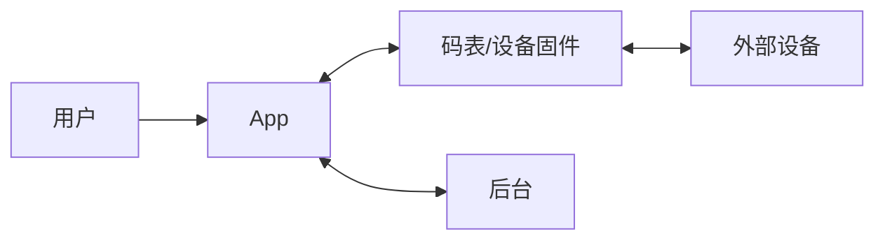
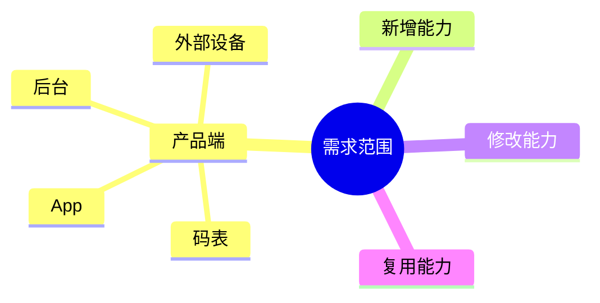
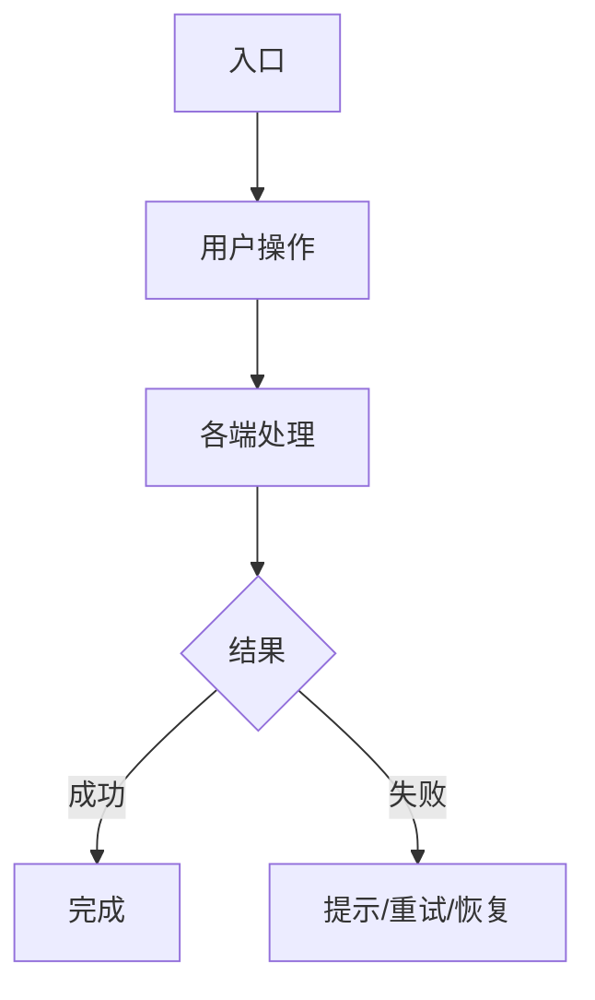
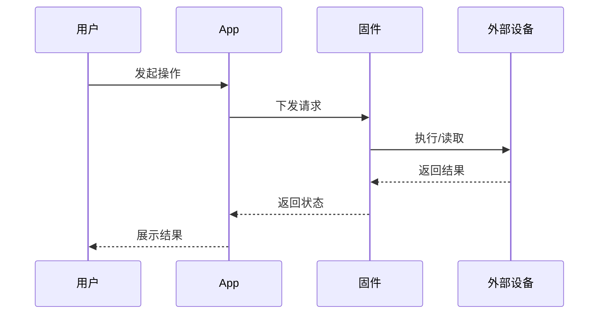
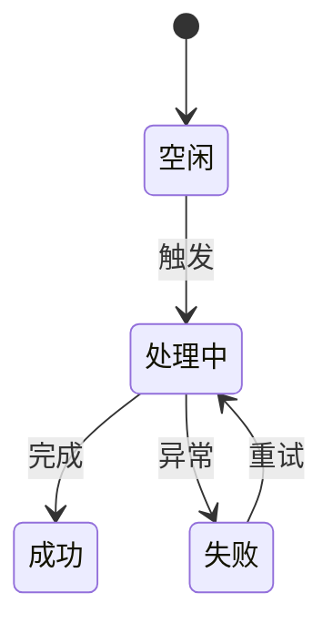
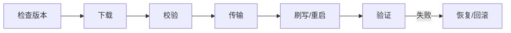

# [需求名称]｜复杂/新功能 PRD

> 用于新设备、新协议、跨端功能、复杂状态机和 OTA。先写清产品行为，再按需补充固件细节。
>
> **明确分工**：PRD 由 PM 起草。原型设计（Figma 文件）由 PM 主导；如需 AI 协助画图或改图，可下达具体任务。PRD 文档中的链接 Figma Frame / 嵌入截图 / 添加参考图，这些内联引用由 PM 自行补充。

## 0. 基本信息

| 需求名称 |  | 负责人/协作人 |  |
|---|---|---|---|
| 需求来源 |  | 适用产品/机型 |  |
| 目标固件/App/后台版本 |  | 文档状态 | 初版 / 评审中 / 已确认 |
| 最后更新 | YYYY-MM-DD |  |  |

## 1. 背景

- 用户/场景：
- 当前问题或机会：
- 需求依据：

## 2. 目标

1. 
2. 

## 3. 实现方案

说明入口、涉及端、核心协同方式和用户结果。

| 层级 | 方案 |
|---|---|
| 硬件/物理层 | 涉及的屏幕、按键、灯、声音、传感器、存储或无线资源 |
| 固件/协议层 | 状态、配置、连接、ANT+ / BLE、**FIT**、日志或 OTA |
| App 业务层 | 配置、设备管理、同步、提示或升级 |

### 3.1 涉及端

| 端 | 负责什么 |
|---|---|
| 码表硬件/固件 |  |
| 外部设备 |  |
| OnelapFit App |  |
| 后台/云服务 |  |

### 3.2 端到端关系

涉及多个端时画图；单端需求删除代码块。

## 4. 功能范围

| 范围 | 内容 |
|---|---|
| 产品端 | 码表 / App / 后台 / 外部设备 |
| 新增能力 |  |
| 修改能力 |  |
| 复用能力 |  |

## 5. 业务流程

选择一种最能说明问题的图，不要求流程图、时序图、状态图全部出现。

### 5.1 主流程

| 步骤 | 前置条件 | 用户操作 | 各端处理 | 结果 |
|---|---|---|---|---|
| 1 |  |  |  |  |
| 2 |  |  |  |  |

### 5.2 多端流程（涉及多端时填写）

### 5.3 状态变化（状态较多时填写）

| 状态 | 进入条件 | 用户可操作 | 系统行为 | 退出条件 |
|---|---|---|---|---|
|  |  |  |  |  |

## 6. 功能说明

### 6.1 [功能名称]

| 项目 | 内容 |
|---|---|
| 入口 |  |
| 场景 |  |
| 前置条件 |  |
| 用户操作 |  |
| 系统行为 |  |
| 页面/设备反馈 |  |
| 异常处理 |  |

#### 交互要点

- 页面/弹窗名称：
- 页面跳转：
- 主要元素：
- 可操作控件及结果：
- 需要呈现的状态：
- 设计图：由 PM 在 Figma 中绘制后，PM 自己把 Frame 链接或截图补进本文

### 6.2 [功能名称]

按 6.1 继续填写；没有第二个功能时删除本节。

## 7. 专业补充（按需填写）

### 7.1 设备与协议

| 设备 | 协议/Device Profile | 发现/连接 | 主要数据或控制 | 断连处理 |
|---|---|---|---|---|
|  | ANT+ / BLE / 私有协议 |  |  |  |

涉及骑行外设时，明确 **HRM、BSC、BP、FE-C、Radar、LEV** 等 Profile；BLE 明确标准 GATT 或私有服务。

### 7.2 数据与持久化

| 数据 | 来源 | 用途 | 保存位置 | 兼容处理 |
|---|---|---|---|---|
|  |  |  |  |  |

涉及骑行记录时，说明 **FIT** 实时写入和断电保护。

### 7.3 OTA（仅 OTA 需求填写）

| 阶段 | 用户看到什么 | 失败/断电处理 |
|---|---|---|
| 下载/校验 |  |  |
| 传输/刷写 |  |  |
| 重启/验证 |  |  |

### 7.4 版本与兼容

| 项目 | 要求 |
|---|---|
| 支持机型 |  |
| 最低固件/App 版本 |  |
| 国内/海外差异 |  |
| 新旧版本协同 |  |

## 8. 验收与待确认

| 场景 | 操作 | 预期结果 |
|---|---|---|
|  |  |  |

| 待确认问题 | 负责人 | 结论 |
|---|---|---|
|  |  | 待确认 |

## 9. 修订记录

| 版本 | 日期 | 修改人 | 修改内容 |
|---|---|---|---|
| v0.1 | YYYY-MM-DD |  | 初版 |
