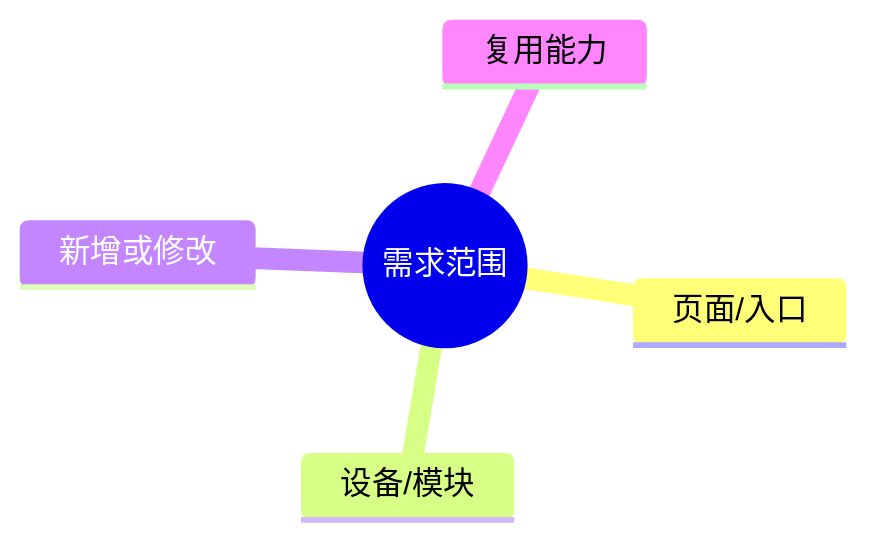
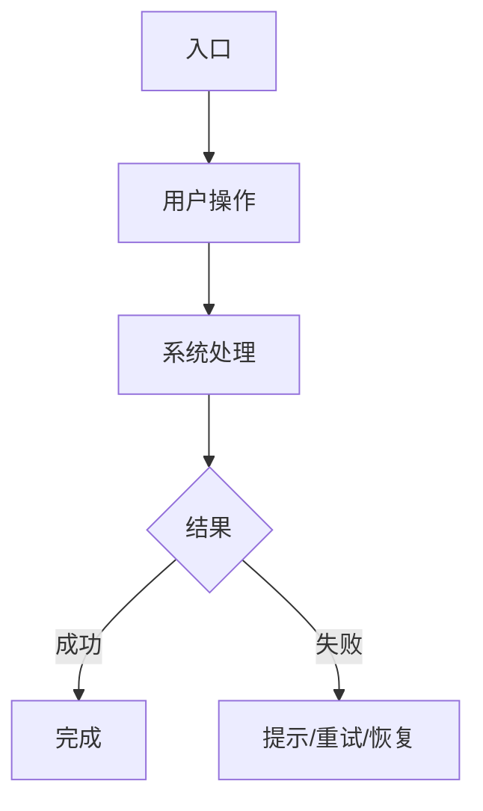

# [需求名称]｜轻量功能迭代 PRD

> 用于现有功能、小功能和单点规则调整。
>
> **明确分工**：PRD 由 PM 起草。原型设计（Figma 文件）由 PM 主导；如需 AI 协助画图或改图，可下达具体任务。PRD 文档中的链接 Figma Frame / 嵌入截图 / 添加参考图，这些内联引用由 PM 自行补充。

## 0. 基本信息

| 需求名称 |  | 负责人 |  |
|---|---|---|---|
| 需求来源 |  | 适用机型/版本 |  |
| 文档状态 | 初版 / 评审中 / 已确认 | 最后更新 | YYYY-MM-DD |

## 1. 背景

- 用户/场景：
- 当前问题：
- 需求依据：

## 2. 目标

1. 
2. 

## 3. 实现方案

说明入口、核心改动、复用能力和用户结果。

| 层级 | 方案 |
|---|---|
| 硬件/物理层 | 涉及的屏幕、按键、灯、声音、传感器或无线资源；不涉及写“不涉及” |
| 固件/协议层 | 状态、配置、连接、ANT+ / BLE、**FIT** 或 OTA；不涉及写“不涉及” |
| App 业务层 | 配置、同步、提示或展示；不涉及写“不涉及” |

## 4. 功能范围

| 范围 | 内容 |
|---|---|
| 页面/入口 |  |
| 设备/模块 |  |
| 新增或修改 |  |
| 复用能力 |  |
| 不改变 |  |

## 5. 业务流程

有明显流程时画一张最能说明问题的图；没有流程图需求时删除代码块。

| 步骤 | 前置条件 | 用户操作 | 系统行为 | 结果 |
|---|---|---|---|---|
| 1 |  |  |  |  |
| 2 |  |  |  |  |

## 6. 功能说明

### 6.1 [功能名称]

| 项目 | 内容 |
|---|---|
| 入口 |  |
| 场景 |  |
| 前置条件 |  |
| 用户操作 |  |
| 系统行为 |  |
| 页面/设备反馈 |  |
| 异常处理 |  |

#### 交互要点

- 页面/弹窗名称：
- 页面跳转：
- 主要元素：
- 可操作控件及结果：
- 需要呈现的状态：
- 设计图：由 PM 在 Figma 中绘制后，PM 自己把 Frame 链接或截图补进本文

### 6.2 [功能名称]

按 6.1 继续填写；没有第二个功能时删除本节。

## 7. 必要补充（按需填写）

### 7.1 设备与版本

| 项目 | 要求 |
|---|---|
| 支持机型 |  |
| 最低固件/App 版本 |  |
| 国内/海外差异 |  |
| 旧版本兼容 |  |

### 7.2 验收

| 场景 | 操作 | 预期结果 |
|---|---|---|
|  |  |  |

### 7.3 待确认

| 问题 | 负责人 | 结论 |
|---|---|---|
|  |  | 待确认 |

## 8. 修订记录

| 版本 | 日期 | 修改人 | 修改内容 |
|---|---|---|---|
| v0.1 | YYYY-MM-DD |  | 初版 |
