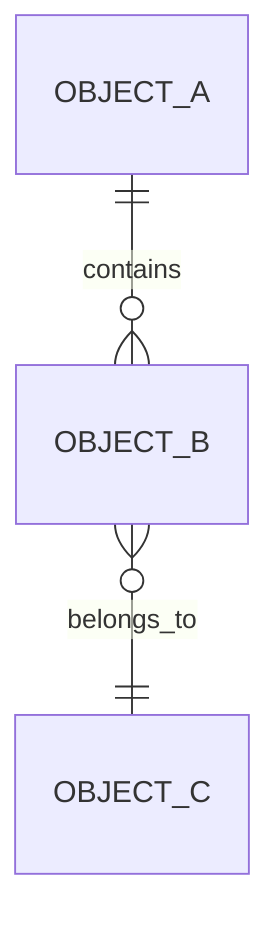
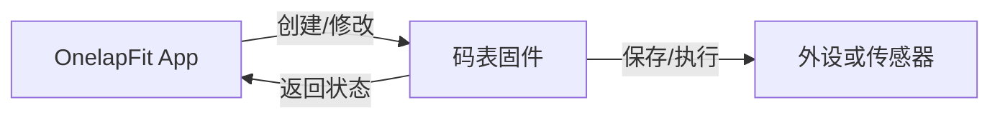

# 对象与字段清单模板

> 用于复杂功能、跨码表/App/外设需求，以及任何涉及配置、关系、同步或持久化的需求。
> 本文件先定义产品对象和数据边界，不替代详细接口或数据库设计。

## 0. 使用规则

- 先填写已确认内容；未知内容写“待确认”，不得用猜测补齐。
- 字段必须说明来源、可见端、可修改端和生命周期。
- 只有影响用户行为、状态判断、兼容性或验收的字段才需要写入本表。
- 同一对象在不同端的显示名称必须统一；展示文案可在 Demo 版 PRD 中单独定义。

## 1. 对象关系

| 对象 ID | 对象名称 | 一句话定义 | 创建端 | 维护端 | 关联对象 | 生命周期 | 备注 |
|---|---|---|---|---|---|---|---|
| OBJ-001 |  |  |  |  |  |  |  |

## 2. 对象字段

| 对象 ID | 字段 ID | 字段名称 | 类型/格式 | 是否必填 | 默认值 | 来源 | 可见端 | 可修改端 | 保存位置 | 变更影响 |
|---|---|---|---|---|---|---|---|---|---|---|
| OBJ-001 | FIELD-001 |  |  |  |  | 码表 / App / 外设 / 计算 |  |  |  |  |

## 3. 关系与约束

| 约束 ID | 约束内容 | 触发条件 | 系统处理 | 影响端 | 状态 |
|---|---|---|---|---|---|
| RULE-001 |  |  |  |  | 已确认 / 判断 / 待确认 |

## 4. 数据流向

| 数据/事件 | 产生端 | 传递端 | 接收端 | 是否需要持久化 | 断连/断电处理 | 备注 |
|---|---|---|---|---|---|---|
|  |  |  |  |  |  |  |

## 5. 事实、判断与待确认

| 类型 | 内容 | 依据/来源 | 对范围或原型的影响 |
|---|---|---|---|
| 事实 / 判断 / 待确认 |  |  |  |

## 6. 完成检查

- [ ] 主要业务对象已列出。
- [ ] 对象之间的关系已明确。
- [ ] 页面要展示的字段都有来源。
- [ ] 字段的可见端、可修改端和保存位置已区分。
- [ ] 关键约束没有藏在自然语言描述中。
- [ ] 未确认内容已单独列出。
