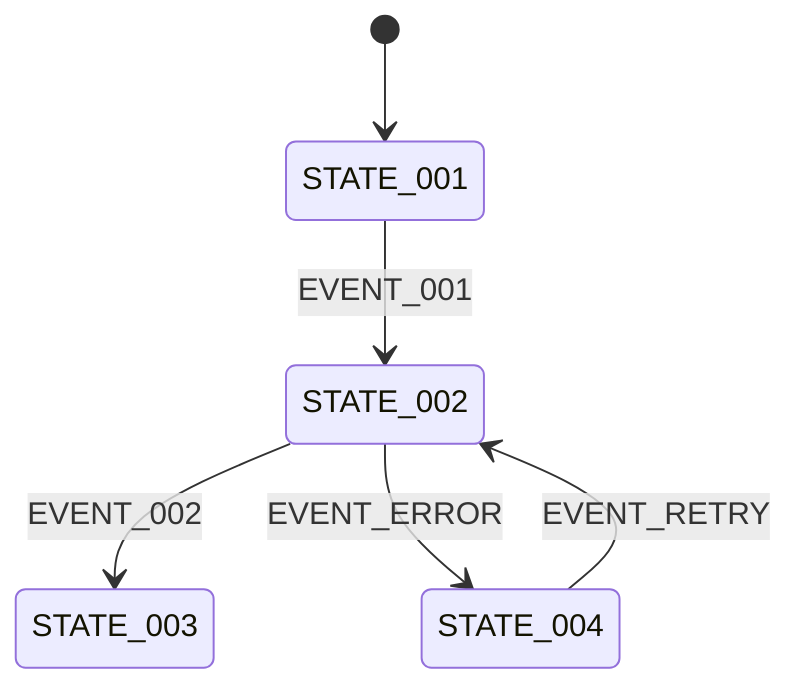

# 状态—事件—操作矩阵模板

> 用于连接、配对、同步、OTA、车灯、雷达、通知、防盗、训练和其他具有进行中/成功/失败/恢复分支的功能。

## 0. 使用规则

- 状态描述“系统现在是什么情况”，事件描述“什么导致变化”，操作描述“用户现在能做什么”。
- 主流程和异常流程必须分别覆盖。
- 区分 App 状态、码表状态、外设状态和跨端任务状态；不要用一个状态名代替多个端的真实状态。
- 自动变化必须写清触发条件和结果；未确认的自动恢复不得自行补充。

## 1. 状态定义

| 状态 ID | 所属端/对象 | 状态名称 | 用户可见表达 | 进入条件 | 退出条件 | 是否持久化 | 状态来源 |
|---|---|---|---|---|---|---|---|
| STATE-001 |  |  |  |  |  |  | 事实 / 判断 / 待确认 |

## 2. 状态转换

| 转换 ID | 当前状态 | 触发事件 | 前置条件 | 系统行为 | 下一状态 | 用户反馈 | 失败/超时处理 |
|---|---|---|---|---|---|---|---|
| TRANS-001 | STATE-001 | EVENT-001 |  |  | STATE-002 |  |  |

## 3. 操作权限

| 操作 ID | 操作名称 | 操作端 | 可执行状态 | 触发事件 | 成功结果 | 失败结果 | 是否需要确认 |
|---|---|---|---|---|---|---|---|
| ACTION-001 |  | App / C706 / 外设 |  |  |  |  |  |

## 4. 多端状态对照

| 业务场景 | App 状态 | 码表状态 | 固件/任务状态 | 外设状态 | 用户看到的统一结果 |
|---|---|---|---|---|---|
|  |  |  |  |  |  |

## 5. 异常与恢复

| 异常 ID | 异常触发 | 当前状态 | 用户反馈 | 用户可操作 | 系统自动处理 | 恢复后状态 | 待确认项 |
|---|---|---|---|---|---|---|---|
| ERROR-001 |  |  |  | 重试 / 取消 / 返回 / 无 |  |  |  |

## 6. 完成检查

- [ ] 每个进行中状态都有成功、失败或取消出口。
- [ ] 每个用户操作都限定了可执行状态。
- [ ] 超时、断连、断电和版本不兼容已按需覆盖。
- [ ] App、码表、固件和外设的状态没有混用。
- [ ] 异常状态提供了明确的下一步。
- [ ] 自动恢复、回滚或兜底逻辑有事实依据或标记待确认。
