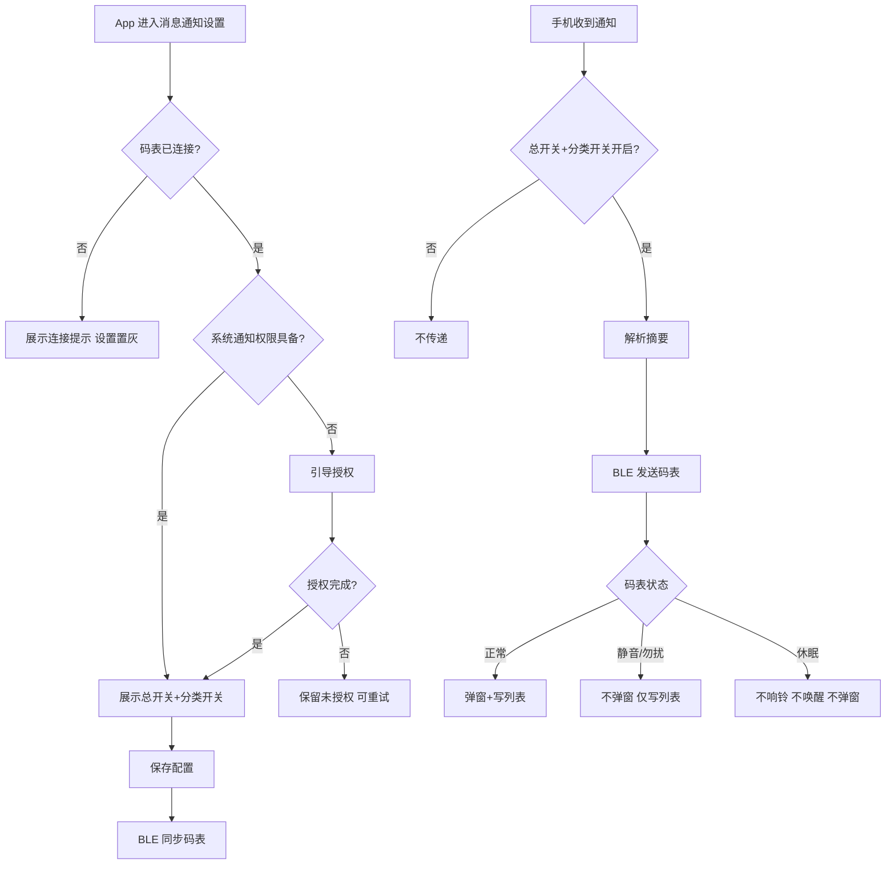
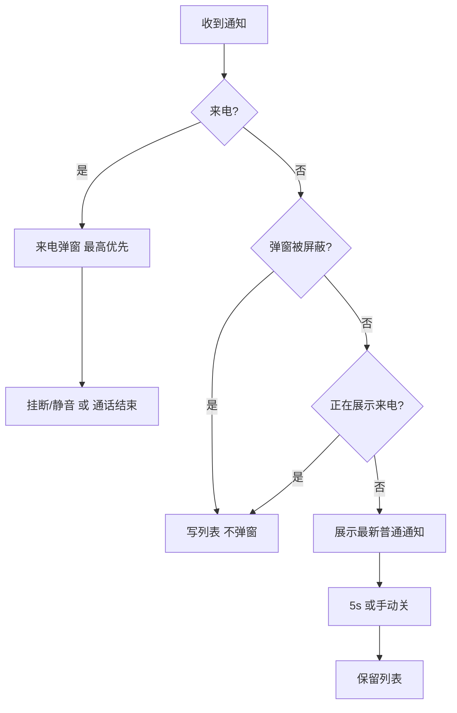

# 消息通知专项 PRD（定稿版）

> **协同文档**（飞书，待确认清单与推进状态）：https://aimagene.feishu.cn/docx/MKW5dUPf1o9R4rxyNk6cBeg8nTb

> **文档类型**：专项需求文档（补全定稿）
> **文档版本**：V2.8
> **定稿日期**：2026-08-17（V2.0 定稿于 2026-08-14，V2.1–V2.8 为评审/grill 收敛修订）
> **事实源**：`迈金码表全功能整合PRD_V2.md` §3.5.1（benchmark，SSOT）
> **底稿**：`消息通知专项PRD-整理版.md` V1.1（draft）
> **范围说明**：覆盖手机通知经 App 传递至码表后的配置、传输、弹窗、消息列表、来电、消息静音与勿扰处理。**音乐控制不在此范围**（见 benchmark §3.5.2，独立功能）。

---

## 一、需求背景与目标

### 1.1 功能定义

结论先行：消息通知将手机上的**来电、短信及第三方应用通知**同步到码表，让用户骑行中无需掏手机即可感知重要信息。

### 1.2 用户场景

- 骑行中收到电话，在码表上识别来电联系人，执行挂断 / 手机端静音。
- 骑行中收到微信、短信、KakaoTalk（海外）等通知，快速看到来源、联系人与消息摘要。
- 训练 / 比赛 / 需要专注时，关闭弹窗，但仍可在消息列表回看。

### 1.3 需求目标

- App 提供消息通知**总开关**与**按来源分类开关**。
- 码表正常状态弹窗，按**来电 > 普通通知**优先级处理冲突。
- 码表保留**消息列表**，支持详情与清空。
- 明确**亮屏 / 熄屏 / 休眠 / 消息静音 / 勿扰 / 长续航**各状态下的展示差异。

---

## 二、人群归位（L1–L6）

> 依据 `knowledge-base/03_人群与方法论/6层人群模型.md` 的 3 问锁定法。以下为**判断**，非事实。

**3 问判定**：① 故障是否不可挽回？否（漏接通知不致命）；② 数据需结合专业理论？否（通信需求非运动数据）；③ 能否接受额外关注？依场景分化。

**结论：全人群通用功能，但价值分两层**——通知传递/回看服务 L3–L6 日常通信；**勿扰 / 静音 / 来电优先**锚定 L1–L2 专注价值。

| 层级 | 需求浓度（判断） | 价值锚点 |
|------|:---:|---------|
| L1 职业竞技 | 15% | 勿扰模式下不错过教练组关键来电 |
| L2 硬核发烧 | 20% | 消息静音 + 来电优先，训练不被干扰 |
| L3 进阶爱好者 | 25% | 骑行中通信刚需（主归位） |
| L4 减脂健身 | 15% | 骑行中接电话、看微信 |
| L5 社交休闲 | 15% | 高频看消息、分享场景 |
| L6 城市通勤 | 10% | 通勤接听与免掏手机 |

**L1–L3 合计 60%**，踩线满足战略红线；勿扰 / 静音 / 来电优先是专业用户的核心价值，不得因"小白友好"弱化。

---

## 三、三层架构总览

| 层 | 职责 |
|----|------|
| 硬件/物理层 | 屏幕展示弹窗/列表/详情；扬声器提示音（沿用声音专项）；物理按键与触屏关闭/进入列表/来电操作 |
| 固件/协议层 | BLE GATT notify 事件驱动接收通知（App 推送，码表被动接收，智能穿戴常见实现）；弹窗/列表/静音/勿扰状态机 |
| App 业务层 | 总开关/分类开关、系统通知权限引导、通知解析与 BLE 下发、国内/海外差异 |

---

## 四、功能范围与端侧分工

| 端/模块 | 负责内容 |
| --- | --- |
| App 端 | 总开关、通知来源开关、系统权限引导、连接状态提示、配置同步 |
| 手机系统 | 读取系统通知、提供来电/通知权限、向 App 提供通知事件 |
| 码表端 | 接收通知、弹窗、来电弹窗、消息列表、详情、消息静音/勿扰状态 |
| BLE 链路 | App↔码表传输通知摘要/状态/控制指令（**协议字段待研发补充**，见 §八） |

---

## 五、核心流程

### 5.1 App 配置与通知传递

### 5.2 码表通知处理优先级

### 5.2.1 弹窗全局优先级（按历史文档口径）

> **依据**：workspace benchmark《迈金码表全功能整合PRD_V2.md》§806-807「多弹窗优先级」——**来电最高打断一切、消息通知最低**。style.md 弹窗队列已按此口径同步。

普通通知（消息通知）在全局弹窗体系中**最低**；来电最高，打断一切（含导航转向、赛段、普通通知）。完整优先级从高到低：

| 档位 | 弹窗性质 | 与消息通知的关系 |
| --- | --- | --- |
| 🔴 来电 | 手机通话呼入 | **最高，打断一切**（含导航转向/赛段/普通通知） |
| 🔴 安全预警 | 低电量告警、关机提醒 | 打断普通通知弹窗 |
| 🟠 核心指令 | 结束骑行确认、手动关机 | 打断普通通知弹窗 |
| 🟡 导航引导 | 转向、偏航 | 高于普通通知；普通通知**不打断**转向/偏航 |
| 🟡 骑行辅助 | 爬坡提醒、赛段提醒 | 高于普通通知；普通通知不打断 |
| 🟡 通知提醒 | 智联助手、普通通知 | **消息通知在此档最低**；普通通知与智联互斥（后到者等待） |
| 🟢 事务操作 | 删除确认、数据项选择 | 普通通知可打断 |
| ⚪ 状态反馈 | 收藏成功、上传成功 | 普通通知可打断 |

> **口径说明**：来电最高、消息通知最低、导航高于普通通知，均来自历史文档 §806-807；来电与安全预警（关机提醒）的相对优先级历史文档未覆盖，留待 PM 后续更新。

---

## 六、App 端需求

### 6.1 入口与页面

入口：`App > 已连接设备 > 码表设置 > 通用设置 > 智能通知 > 消息通知`。

页面含：消息通知总开关 + 电话/短信/微信/QQ + 其他应用（飞书/钉钉/企业微信/TIM/抖音/微博/小红书/快手/知乎/支付宝/系统通知/其他应用）。

### 6.2 总开关与分类开关

| 场景 | 处理 |
| --- | --- |
| 总开关开 | 允许满足分类开关条件的通知传递到码表 |
| 总开关关 | 不传递；历史消息列表不受影响 |
| 分类开关关 | 仅阻止该来源传递，其他来源不受影响 |
| 未连接码表 | 可编辑本地/账号配置；同步延后至下次连接（口径统一：**可编辑 + 延后同步**，不再"置灰"，draft V1.1 §4.2 依据） |

### 6.3 海外差异

- **KakaoTalk**：海外版 App 提供独立开关，**正式立项**（PM 确认）；国内版不展示。韩文联系人/消息经字符兼容处理，字库不支持字符按 `□` 展示；韩文字库覆盖范围待研发确认（体验下限）。
- **Line**：**仅海外版支持，独立开关**（PM 确认）；国内版不展示。

### 6.4 系统权限与异常状态

- 首次进入检查系统通知读取/转发权限；拒绝后保留页面可重试；系统设置关闭后下次进入重新检测。
- 异常状态表：

| 状态 | 页面表现 | 用户操作 |
| --- | --- | --- |
| 未连接码表 | 顶部提示"未连接码表，改动将在连接后同步"，设置项**可编辑**（非置灰） | 连接后自动同步 |
| 未授权 | 显示"未授权"及授权入口 | 前往系统设置 |
| 同步中 | 开关显示同步态，防重复提交 | 等待 |
| 同步失败 | 提示原因 + 重试 | 重试或稍后 |
| 系统不支持 | 显示不支持原因 | 查看说明 |

**同步超时**（判断）：同步中若 5 秒内未完成，回退为失败态并提供重试，避免「同步中」状态卡死无出口。

---

## 七、码表端需求

### 7.1 普通通知弹窗

- 任意页面弹出；**5 秒**倒计时关闭，可手动关闭。
- 内容：应用 icon、好友名称、新消息条数、消息内容（**10 显示字符位**，超出省略 + "…"，不滚动）。
- 字符位计法（PM 确认）：CJK 1 位、ASCII 0.5 位，第 11 位起截断。
- **新消息条数语义**（PM 确认）：条数 = 同 App 未读消息聚合，由 App 聚合下发；列表仍逐条存储，条数不占列表位。**显示上限 99+**（超出显示"99+"）。
- 字库不支持字符显示 `□`。
- 被来电打断的普通通知进列表不再补弹。
- 兜底（判断）：未知应用显示默认占位 icon；未知联系人显示「未知」；缺失图标/字库外字符按 `□` 或占位处理。

**消息内容分类**（非纯文本按分类文案展示）：

| 手机内容 | 码表展示 |
| --- | --- |
| 文字 | 读取文字内容 |
| 图片 / 表情 / 文件 / 链接 / 视频 / 语音通话 / 视频通话 | `[图片]` `[动画表情]` `[文件]` `[链接]` `[视频]` `[语音通话]` `[视频通话]` |

### 7.2 来电弹窗（最高优先级）

- **打断一切**（含导航转向/赛段/普通通知）；不被其他弹窗打断。
- 已知联系人：`姓名 + 来电`；未知：`未知 + 电话号码`。
- 支持「挂断」「手机端静音」两个动作（依据历史文档 §533，来电只有挂断/静音两动作；具体按钮依赖手机系统能力，待确认）。
- 来电弹窗**不自动关闭**，持续到用户操作或通话结束（判断：来电是实时通信，自动关闭会让用户错过；偏离 draft「5 秒自动关闭」口径，benchmark 未提 5s）。
- 来电期间来新来电：展示**最新来电**，替换当前来电弹窗（判断）。

**来电 × 状态豁免矩阵**（PM 决策：码表是骑行设备，通知为弱提醒，特殊状态来电不响不亮）：

| 码表状态 | 响铃 | 亮屏 | 弹窗 | 进列表 |
|---|---|---|---|---|
| 正常亮屏 | ✅ 响 | ✅ 亮 | ✅ 弹 | ✅ |
| 熄屏 | ❌ 不响 | ❌ 不亮 | ❌ 不弹 | ✅ |
| 休眠 | ❌ 不响 | ❌ 不亮 | ❌ 不弹 | ✅ |
| 消息静音 | ❌ 不响 | ❌ 不亮 | ❌ 不弹 | ✅ |
| 勿扰 | ❌ 不响 | ❌ 不亮 | ❌ 不弹 | ✅ |
| 长续航 | ❌ 不响 | ❌ 不亮 | ❌ 不弹 | ✅ |

### 7.3 消息列表（负一屏最后一页）

- 标题"消息通知"；有消息时显示清空按钮，清空后显示"暂无消息通知"。
- 时间倒序，最新在上；满容量移除最早消息。
- **列表条目 = 逐条通知事件（PM 决策）**：同 App 连来 N 条占 N 个列表位，不聚合；满容量时移除最早条目。
- **容量：C706 20 条；6 系 5 条；C716/C716 Pro 20 条（PM 确认）。**
- 点击进入详情页看完整内容。**详情页全量展示协议下发的全部正文、可滚动、不截断**（PM 确认）；非文本类按分类文案展示。
- **清空二次确认**（PM 确认）：点击清空弹出确认，避免骑行中误触不可逆丢失。
- **持久化**（PM 确认）：消息列表为临时通知记录，存 RAM，**掉电/重启后清空**，不持久化到 Flash（理由见 `adr/0001-消息列表不持久化.md`）。
- **清空 × 满容量竞态**（评审遗留 Y12 收敛 · 判断）：清空是显式用户操作，与满容量移除并发时**清空优先**——清空立即生效，清空后新消息按容量重新累积。详情页一旦打开，正文已在内存中，满容量移除只影响列表，不影响已打开的详情页；返回列表时该条目已不存在（列表已更新）。

### 7.4 消息静音 vs 勿扰（判断：两个独立开关）

> **判断依据**：benchmark §3.5.1 已将二者明确定义为不同概念，保留两个开关。

| 能力 | 语义 | 默认 | 行为 |
| --- | --- | --- | --- |
| **消息静音**（原 C706 勿扰模式） | 关通知弹窗与通知音 | 关闭 | 不弹窗、不响通知音，消息仍进列表 |
| **勿扰模式**（骑行专注） | 关声音+部分弹窗 | — | 屏蔽声音与部分弹窗，**安全预警例外保留声音**（PM 覆盖 benchmark「全量屏蔽声音」口径）；保留安全预警/核心指令/必要导航弹窗；**声音按钮静音且不可调节**；被屏蔽的弹窗关闭后不补弹；关闭后恢复开启前声音 |

**码表端入口**（评审遗留 M4 收敛，draft V1.1 §5.5 线框依据）：**消息静音开关位于码表端「消息通知」列表页顶部**（标题行下方、消息条目上方）；勿扰模式属系统级骑行专注能力，入口不在消息通知页（入口位置沿用系统设置，本 PRD 不定义）。

**叠加行为（判断）**：勿扰优先级高于消息静音。勿扰开启时，消息静音开关隐藏或置灰（避免重复设置）；若两开关独立开启，按勿扰行为处理（更严格）。

**勿扰声音恢复快照点**（评审遗留 Y4 收敛 · 判断）：「关闭勿扰后恢复开启前声音」中的「开启前」= **进入勿扰前一刻的声音状态快照**（含音量大小与静音态）。进入勿扰时快照当前声音，退出勿扰时恢复到该快照；勿扰期间声音按钮静音不可调，用户无法改变快照。

### 7.5 特殊系统状态（状态矩阵）

| 码表状态 | 声音 | 屏幕唤醒 | 通知弹窗 | 消息列表 |
| --- | --- | --- | --- | --- |
| 正常亮屏 | 按声音设置 | — | 弹 | 写列表 |
| 熄屏 | 响声音 | 不唤醒 | 不弹 | 写列表 |
| 休眠 | 不响 | 不唤醒 | 不弹 | 不展示，**写列表**（与长续航一致，PM 确认） |
| 消息静音 | 不响通知音（静音同时关弹窗+通知音，PM 确认） | 不唤醒 | 不弹 | 写列表 |
| 勿扰 | 静音（声音按钮不可调），**安全预警例外响铃**（PM 确认） | 不唤醒 | 通知不弹；**白名单保留弹窗：低电量告警、关机提醒、结束骑行确认、转向/偏航导航；不保留：智联、普通通知、赛段提醒**（PM 确认） | 写列表 |
| 长续航 | 不响 | 不唤醒 | 不弹 | 写列表（不弹不响不亮），退出可回看（PM 决策） |

> **状态语义已收敛（grill 定稿）**：熄屏/休眠/静音/勿扰/长续航五态均已逐格定义「声音/唤醒/弹窗/列表」行为——共同点是**消息一律写列表，差异只在响不响、亮不亮、弹不弹**。固件状态机与测试矩阵按本表逐格实现，不得用单一"通知开关"合并处理。

**断连回连**（判断）：BLE 断连期间，App 侧暂存通知，**暂存上限 20 条**（PM 确认，与列表容量对齐）；回连后补推最新一批（超出上限丢弃最早）。码表断连期间不接收，回连后按补推消息进列表。

**低电量降级**（判断）：低电量触发长续航时，通知按长续航策略（接收但不打扰，见上表）；未进入长续航前，低电量不额外影响通知行为。

---

## 八、协议与数据字段

> **协议实现方向（PM 决策）**：采用 **BLE GATT 标准**——App 收到系统通知后经 GATT 特征值 **notify** 事件驱动推送到码表，码表被动接收（智能穿戴/手环常见实现，无周期轮询，功耗可控）；码表端操作（挂断/静音/清空）经 **write/indicate** 特征值回传 App。
> - **手机端通知获取**：iOS 用 **ANCS（Apple Notification Center Service）** 标准 BLE 服务（**已核实**，见 `00-竞品调研.md` §1.1，Apple 官方 ANCS Spec）；Android 用 **NotificationListenerService** 通知监听服务（**待 App 确认**，属 App 职责范围，本环境未核实一手原文，见 `00-竞品调研.md` §1.2）。
> - 具体 GATT Profile（标准 ANS 或迈金自定义服务）、特征值表、字段编码、分包、MTU 仍待研发补充。
>
> 以下为**需求层建议字段**：

| 字段 | 说明 | 状态 |
| --- | --- | --- |
| notification_id | 通知唯一标识（去重/列表更新） | 待研发确认 |
| app_id / app_name | 应用标识与显示名 | 待确认 |
| app_icon | 应用 icon / 默认 icon 兜底规则 | 待确认 |
| notification_type | 来电/文字/图片/文件等类型 | 分类已定，编码待确认 |
| sender_name | 联系人/群名 | 12 显示字符位，超出省略（PM 确认） |
| unread_count | 同 App 新消息条数 | 已定义，范围待确认 |
| content | 消息摘要/详情正文 | 弹窗 10 字；协议长度待确认 |
| timestamp | 通知时间 | 来源 = App（手机）时间（判断），码表按本地时区展示；格式待确认 |
| call_action | 挂断/手机端静音 | 系统能力待确认 |
| source_platform | 国内/海外、Android/iOS | KakaoTalk 等差异处理，待确认 |

**展示长度（显示字符位口径，PM 确认，超出省略 + "…"）**：App 名称 10 位；联系人/群名 12 位；弹窗内容 10 位。同一套计法（CJK 1 位、ASCII 0.5 位）。

---

## 九、设备与版本限制

| 能力 | C706 | C606/C606 Pro/C606 V2/C506 | C716/C716 Pro | 迪卡侬 EDR |
| --- | --- | --- | --- | --- |
| App 消息通知开关 | 支持 | 支持 | 支持（PV3.2，机型功能矩阵 SSOT 依据）| 不支持（benchmark：EDR 整模块删除智联） |
| 普通通知弹窗 | 支持 | 支持 | 支持（PV3.2，机型功能矩阵 SSOT 依据）| 不支持（同上） |
| 消息列表容量 | 20 条 | 5 条 | 20 条（PM 确认） | 不适用 |
| 消息静音/勿扰 | 历史资料支持 | 历史资料支持 | 支持（PV3.2，机型功能矩阵 SSOT 依据）| 不适用 |
| 来电控制 | 历史资料支持 | 待确认 | 待确认 | 不适用 |
| KakaoTalk | 海外版已立项（PM 确认） | 海外版同策略 | 同策略 | 不适用 |

> **6 系小屏降级**（评审遗留 Y14 收敛 · 待确认）：6 系（C506 等）屏幕规格与 C706 不同，弹窗布局、10 显示字符位截断策略、来电按钮排布是否与 C706 一致，待研发确认各机型屏幕规格后定义。列表容量已定（6 系 5 条），但弹窗视觉降级未定。

---

## 十、验收标准

- [ ] App 进入设置页能展示总开关与全部已支持来源开关。
- [ ] 未连接码表时展示连接提示，不执行需在线的同步。
- [ ] 未授权时明确提示并引导授权。
- [ ] 关总开关后新通知不传递至码表。
- [ ] 关某分类开关后该来源不传递，其他不受影响。
- [ ] 海外版 App 展示 KakaoTalk 开关，国内版按策略展示/隐藏。
- [ ] 普通通知任意页面弹出，5 秒自动关闭。
- [ ] 弹窗展示 icon/联系人/新消息条数/内容，内容按 10 字限制。
- [ ] 非纯文本通知展示对应分类文案。
- [ ] 来电打断普通通知，普通通知不打断来电。
- [ ] 消息时间倒序进列表，满容量移除最早。
- [ ] 清空后展示"暂无消息通知"。
- [ ] 开启静音/勿扰后不弹窗，消息仍进列表。
- [ ] 熄屏/休眠符合对应声音与屏幕规则。

---

## 十一、埋点建议

| 事件 | 关键字段 | 触发时机 |
| --- | --- | --- |
| notification_setting_view | model, os, permission_state | 进入 App 设置页 |
| notification_toggle | app_name, region, os, switch_state | 切换开关 |
| notification_sync | model, result, reason | 配置同步 |
| notification_popup | app_name, type, interrupted | 码表弹窗 |
| notification_close | close_type | 自动/手动/被来电打断 |
| notification_list_view | message_count | 打开列表 |
| notification_detail_view | app_name, type | 打开详情 |
| notification_clear | message_count | 清空列表 |
| notification_mute_toggle | switch_state | 切换静音 |
| notification_dnd_toggle | switch_state | 切换勿扰 |

---

## 十二、待确认项收敛（grill 后终态）

### 已解决（grill 三轮定型，共 8 项）

| 原待确认项 | 结论 |
| --- | --- |
| 消息静音 vs 勿扰是否两个开关 | 保留两个独立开关（benchmark 依据） |
| 展示长度（联系人/App 名/正文） | 显示字符位口径定死；详情正文全量滚动不截断 |
| C716/C716 Pro 列表容量 | 20 条 |
| 休眠态是否缓存 | 写列表（与长续航一致） |
| 长续航策略 | 接收不打扰（写列表，不响不亮不弹） |
| Line 是否入主线 | 仅海外版独立开关 |
| KakaoTalk 独立开关 | 海外版立项，独立开关 |
| 未知兜底语义 | 默认 icon /「未知」/ `□`（视觉细节见下） |

### 仍待确认（全部为研发/App 事实性缺口，非 PM 决策）

| # | 待确认项 | 归属 |
| --- | --- | --- |
| 1 | Android/iOS 通知读取、来电控制权限与系统跳转路径 | App |
| 2 | BLE GATT Profile/特征值/字段编码/分包/最大长度 | 固件 |
| 3 | 来电挂断/关闭/手机端静音的系统能力 | App/系统 |
| 4 | KakaoTalk 通知识别方式/权限/后台限制 | App |
| 5 | KakaoTalk 韩文字符/表情/符号字库覆盖范围 | 码表字库 |
| 6 | KakaoTalk 群聊联系人/群名字段来源 | App 解析 |
| 7 | 未知 icon/兜底样式的具体视觉稿 | 设计 |
| 8 | 6 系（C506/C606 等）小屏弹窗布局/截断/来电按钮的降级规则（屏幕规格待确认，不能"6 系"一刀切） | 固件/设计 |
| 9 | KakaoTalk/Line 适配落地的 App/固件版本号 | PM/发版规划 |
| 10 | BLE 同链路并发：通知突发 vs 配置同步/音乐控制/防盗共链路的吞吐、背压（产品优先级口径已定，见下） | 固件 |

> **BLE 同链路并发优先级（PM 拍板，产品口径）**：安全预警 > 来电 > 普通通知 > 音乐控制 > 配置同步（后台最低）。产品只定"谁先到"档位 + 最坏延迟目标（安全预警 < 500ms），具体队列/背压/分片算法归固件。

---

## 十三、待 PM 确认清单（双视角评审后）

> 评审暴露的核心问题按三类归置。**A 类需你逐项拍板**，收敛后本 PRD 方可转测试设计与固件排期。

### A. 需 PM 拍板（✅ 已拍板）

| # | 结论 | 落点 |
|---|------|------|
| P1 来电 × 状态豁免 | 特殊状态（熄屏/休眠/静音/勿扰/长续航）来电**不响不亮不弹**，仅进列表；正常亮屏**保留响铃+弹窗**（PM 已复核确认：接电话刚需） | §7.2 来电豁免矩阵 |
| P2 长续航通知策略 | **接收但不打扰**（写列表、不弹不响不亮，退出可回看） | §7.5 |
| P3 列表条目聚合语义 | **逐条占位**（通知事件为单位，不聚合） | §7.3 |

### B. 已按 PM 决策处理（✅）

| 项 | 决策 | 落点 |
|----|------|------|
| 1s 轮询功耗（评审 D2） | 改用 BLE GATT notify 事件驱动，码表被动接收（智能穿戴常见实现，无周期轮询） | §三、§八 |

### C. 已给判断（✅ grill 第 3 轮 PM 全部复核通过）

以下需求层判断散见各章节（均标「判断」），PM 已整体复核确认：

| 项 | 结论 | 落点 |
|----|---------|------|
| 断连回连 | 断连期间 App 暂存（上限 20 条），回连补推最新一批 | §7.5 后 |
| 列表持久化 | RAM 易失，掉电/重启清空，不持久化 Flash（见 ADR 0001） | §7.3 |
| 时间戳来源 | App（手机）时间，码表按本地时区展示 | §八 |
| 低电量降级 | 低电量进长续航按长续航策略，未进入前不额外影响 | §7.5 后 |
| 静音+勿扰叠加 | 勿扰优先，勿扰开启时静音隐藏/置灰 | §7.4 |
| 来电打断来电 | 展示最新来电替换当前 | §7.2 |
| 来电自动关闭 | 不自动关闭，持续到操作/通话结束 | §7.2 |
| 休眠缓存 | 写列表（与长续航一致） | §7.5 |
| 未知兜底 / 清空确认 / 同步超时 | 默认 icon / 二次确认 / 5s 超时 | §7.1/§7.3/§6.4 |
| 弹窗全局优先级 | 导航引导提到通知提醒之上（PM 拍板，style.md 队列已同步）；来电 > 普通通知 | §5.2.1 |
| 清空 × 满容量竞态 | 清空优先；详情页已打开不受列表移除影响 | §7.3 |
| 勿扰声音快照点 | 恢复「进入勿扰前一刻」声音快照（含音量/静音态） | §7.4 |

### D. 真需研发/App 补充（PM 推动 · 🔴 阻塞固件排期）

| 项 | 归属 |
|----|------|
| GATT Profile（标准 ANS 或自定义服务）/ 特征值表 / 字段编码 / 分包 / MTU | 固件 |
| 来电挂断/静音系统能力、KakaoTalk 通知识别方式与权限 | App |

---

## 修订记录

| 版本 | 日期 | 修改人 | 修改内容 |
| --- | --- | --- | --- |
| V1.0–V1.1 | 2026-07-15 | Codex | draft 整理版 + KakaoTalk 增补 |
| V2.0 | 2026-08-14 | MFP | 补人群归位（§二）、三层架构总览（§三）；待确认项收敛（§十二，14 项→13 项，1 项判断收敛）；对齐 benchmark 口径 |
| V2.1 | 2026-08-14 | MFP | 协议层改 BLE GATT notify 事件驱动（PM 决策，替代 1s 轮询）；补勿扰 benchmark 细节；新增 §十三 待 PM 确认清单 |
| V2.2 | 2026-08-14 | MFP | PM 拍板落地：P1 来电豁免矩阵（特殊状态不响不亮不弹，正常保留）、P2 长续航接收不打扰、P3 列表逐条占位 |
| V2.3 | 2026-08-14 | MFP | 补手机端通知获取（iOS ANCS / Android 监听）；修正状态矩阵列错位并补勿扰保留部分弹窗；补静音+勿扰叠加行为 |
| V2.4 | 2026-08-14 | MFP | 补齐需求层判断：断连回连/持久化/时间戳/低电量/静音勿扰叠加/来电打断来电/来电不自动关/未知兜底/清空确认/同步超时 |
| V2.5 | 2026-08-15 | MFP | grill 第 1 轮 7 项定型：10 显示字符位省略截断、条数聚合/列表逐条分治、清空二次确认、C716 系 20 条、勿扰白名单点名、无持久化（ADR 0001）、正常来电保留响铃复核 |
| V2.6 | 2026-08-15 | MFP | grill 第 2 轮 6 项定型：消息静音=弹窗+通知音齐关、Line 仅海外、KakaoTalk 海外立项、详情页全量滚动、条数 99+、断连暂存 20 条 |
| V2.7 | 2026-08-15 | MFP | grill 第 3 轮收尾：休眠写列表、名称长度定死（App 10 位/联系人名 12 位）、剩余判断全部复核；EDR 列按 benchmark 定为不支持；待确认仅剩研发/App 事实性缺口 |
| V2.8 | 2026-08-17 | MFP | 待确认清单补 3 项（C716 能力来源、6 系小屏布局、海外适配版本）；§九 C716 "PV3.2 支持"标注为 draft 无来源断言 |
| V2.8 | 2026-08-17 | MFP | 收敛评审遗留 5 项边界：新增 §5.2.1 弹窗全局优先级（Y6，判断）、§7.3 清空×满容量竞态（Y12，判断）、§7.4 勿扰声音快照点（Y4，判断）；BLE 同链路并发（Y4）与 6 系小屏降级（Y14）入 §十二待确认；修复 §5.2 流程图「5s 自动关」与 §7.2「来电不自动关闭」矛盾 |
| V2.9 | 2026-08-17 | MFP | grill 第 4 轮 + 独立审核：①弹窗优先级「导航引导」提到「通知提醒」之上（改 style.md 队列 + §5.2.1）；②C716「PV3.2 支持」消待确认（机型功能矩阵 SSOT 依据，改 §九）；③勿扰下安全预警**保留声音**（PM 覆盖 benchmark「全量屏蔽声音」）+ 白名单去掉 EDR 专属「防盗警报」改「低电量告警/关机提醒」；④BLE 同链路并发优先级口径（安全预警>来电>普通通知>音乐控制>配置同步）；⑤§十二 待确认清单重排编号 |
| V2.10 | 2026-08-17 | MFP | 按历史文档 SSOT 纠偏：①§5.2.1/§7.2 来电改为「最高打断一切」、消息通知「最低」（workspace §806-807），ADR 0002 置 superseded；②来电动作去「关闭」只留「挂断/静音」（workspace §533，同步 §1.2/§5.2流程图/§八 call_action 字段） |
| V2.11 | 2026-08-17 | MFP | 原型验收 M3/M4 收敛：①未连接态统一为「可编辑 + 延后同步」消除 §6.2/§6.4 矛盾（draft V1.1 §4.2 依据）；②明确消息静音开关入口=码表端消息通知列表页顶部（draft V1.1 §5.5 线框依据），勿扰入口不在此页 |
