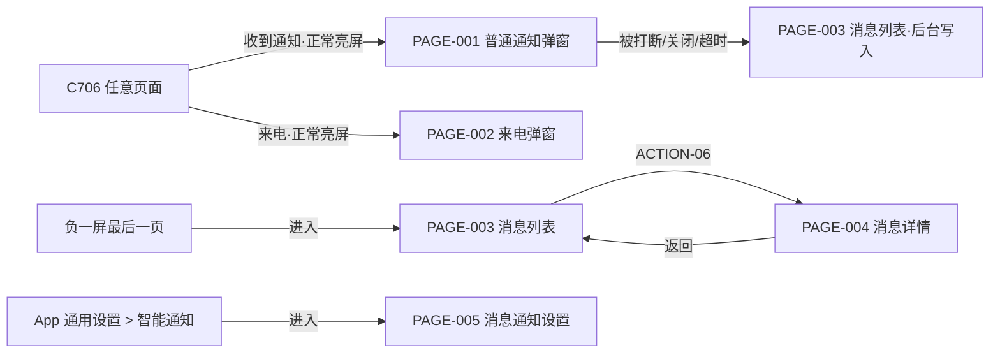

# 消息通知 · 原型输入（Demo 版）

> 依据《Demo版PRD与原型输入规范》产出，解决"原型具体要画什么"。正式需求见 `02-PRD.md`（V2.11）。
> 目标端：**C706 + 顽鹿 App 两端联动**。
> 低保真流程稿（Figma）：https://www.figma.com/design/8G0hqaBAuDhLxE4bZYsl3W （4 个 Section：C706 通知接收与展示 / C706 消息列表与详情 / 顽鹿 App 消息通知设置 / 跨端流程）

## 0. 进入条件核对

| 条件 | 状态 |
|------|------|
| 正式 PRD | ✅ 02-PRD.md V2.11（需求层定稿；实现待冻结） |
| 业务流程/异常流程 | ✅ PRD §五 |
| 对象/字段 | ✅ PRD §八 |
| 状态定义 | ✅ PRD §7.5 状态矩阵（五态逐格定义） |
| 机型/版本范围 | ✅ C706 基线，C716 系同口径；EDR 不支持 |
| 设计系统 | ⚠️ 出图前须走 `magene-design` 路由（顽鹿 App + 迈金 C706） |

## 1. 页面清单

| 页面 ID | 页面名称 | 目标端 | 入口 | 页面目的 | 关联需求 | 页面类型 |
|---|---|---|---|---|---|---|
| PAGE-001 | 普通通知弹窗 | C706 | 任意页面（覆盖层） | 展示最新一条 App 通知摘要 | REQ-02 | 弹窗 |
| PAGE-002 | 来电弹窗 | C706 | 任意页面（覆盖层，最高优先级） | 展示来电并提供接听决策操作 | REQ-03 | 弹窗 |
| PAGE-003 | 消息列表 | C706 | 负一屏最后一页 | 回看全部通知记录 | REQ-04 | 列表 |
| PAGE-004 | 消息详情 | C706 | 列表点击条目 | 查看单条通知完整正文 | REQ-05 | 详情 |
| PAGE-005 | 消息通知设置 | 顽鹿 App | 已连接设备 > 码表设置 > 通用设置 > 智能通知 > 消息通知 | 总开关 + 分类开关 + 权限引导 | REQ-01 | 表单 |

## 2. 页面状态

| 页面 | 状态 ID | 进入条件 | 展示 | 可执行操作 | 退出/跳转 |
|---|---|---|---|---|---|
| PAGE-001 | UI-001 默认 | 正常亮屏收到通知 | icon + 好友名 + 条数 + 内容（10 位省略）+ 5s 倒计时 | 点击关闭 | 倒计时结束/关闭 → 消失，条目进列表 |
| PAGE-001 | UI-002 被来电打断 | 展示中收到来电 | — | — | 立即消失，不补弹 |
| PAGE-002 | UI-003 已知联系人 | 来电 + 通讯录匹配 | 姓名 + 来电 + 操作按钮 | 挂断/手机端静音 | 操作后或通话结束后消失 |
| PAGE-002 | UI-004 未知联系人 | 来电 + 未匹配 | 「未知」+ 电话号码 + 操作按钮 | 同上 | 同上 |
| PAGE-003 | UI-005 有消息 | 列表 ≥1 条 | 标题 + 清空按钮 + 条目（icon/名称/时间/摘要）倒序 | 点击条目、点击清空 | 条目→PAGE-004 |
| PAGE-003 | UI-006 空列表 | 无消息或清空后 | 「暂无消息通知」，无清空按钮 | 返回 | 返回负一屏 |
| PAGE-003 | UI-007 清空确认 | 点击清空 | 确认对话框（复用既有组件） | 确认/取消 | 确认→UI-006；取消→UI-005 |
| PAGE-004 | UI-008 默认 | 点击列表条目 | 来源 + 联系人/群名 + 时间 + 全量正文（可滚动） | 滚动、返回 | 返回 PAGE-003 |
| PAGE-005 | UI-009 已连接已授权 | 码表连接 + 系统权限具备 | 总开关 + 分类开关列表 | 切换开关 | 保存并同步码表 |
| PAGE-005 | UI-010 未连接 | 码表未连接 | 顶部提示「未连接码表，改动将在连接后同步」，设置项可编辑 | 编辑开关 | 连接后自动同步并回 UI-009 |
| PAGE-005 | UI-011 未授权 | 系统通知权限缺失 | 「未授权」+ 授权入口 | 点击去授权 | 授权后回 UI-009 |
| PAGE-005 | UI-012 同步中 | 切换开关后 | 开关同步态（防重复提交） | 等待 | 成功→UI-009；失败→UI-013 |
| PAGE-005 | UI-013 同步失败 | 同步失败/5s 超时 | 失败原因 + 重试 | 重试 | 重试→UI-012 |

## 3. 页面内容与字段

| 页面 | 区域/组件 | 字段/文案 | 数据来源 | 空值/超长处理 | 字段 ID |
|---|---|---|---|---|---|
| PAGE-001 | 弹窗主体 | 应用 icon | app_icon（未知应用默认占位 icon） | 默认 icon | FIELD-01 |
| PAGE-001 | 弹窗主体 | 好友名称 | sender_name | 未知显示「未知」；>12 位省略 + "…" | FIELD-02 |
| PAGE-001 | 弹窗主体 | 新消息条数 | unread_count（同 App 聚合） | >99 显示"99+" | FIELD-03 |
| PAGE-001 | 弹窗主体 | 消息内容 | content | >10 显示字符位省略 + "…"；非文本显示 `[图片]` 等分类文案；缺字显 `□` | FIELD-04 |
| PAGE-002 | 弹窗主体 | 联系人/号码 | 来电信息 | 未知显「未知」+ 号码 | FIELD-05 |
| PAGE-002 | 按钮组 | 挂断/手机端静音 | call_action | 系统不支持的按钮隐藏（视觉待设计确认） | FIELD-06 |
| PAGE-003 | 列表条目 | icon + 名称 + 时间 + 摘要 | 通知事件（逐条） | 时间来源 App；摘要同 FIELD-04 截断 | FIELD-07 |
| PAGE-004 | 正文区 | 完整正文 | content 全量 | 可滚动不截断；非文本显分类文案 | FIELD-08 |
| PAGE-005 | 开关组 | 电话/短信/微信/QQ/其他应用（海外版加 KakaoTalk、Line） | App 配置 | 国内版不显示 KakaoTalk/Line | FIELD-09 |

## 4. 用户操作与反馈

| 操作 ID | 页面 | 用户动作 | 可操作条件 | 系统行为 | 成功反馈 | 失败反馈 |
|---|---|---|---|---|---|---|
| ACTION-01 | PAGE-001 | 点击关闭 | 弹窗展示中 | 关闭弹窗 | 弹窗消失 | — |
| ACTION-02 | PAGE-002 | 挂断 | 来电展示中 + 系统支持 | 经 App 调起系统挂断 | 弹窗消失 | 不支持则按钮隐藏 |
| ACTION-03 | PAGE-002 | 手机端静音 | 来电展示中 + 系统支持 | 手机停止响铃 | 弹窗消失 | 同上 |
| ACTION-04 | PAGE-003 | 点击清空 | 列表 ≥1 条 | 弹出确认框 | — | — |
| ACTION-05 | PAGE-003 | 确认清空 | 确认框展示中 | 清空列表 | 「暂无消息通知」 | — |
| ACTION-06 | PAGE-003 | 点击条目 | 列表 ≥1 条 | 进入详情 | PAGE-004 | — |
| ACTION-07 | PAGE-003 | 切换消息静音开关 | 列表页顶部 | 静音开→不弹不响仍进列表 | 开关状态更新 | — |
| ACTION-08 | PAGE-005 | 切换总/分类开关 | 已连接 | BLE 同步码表 | 开关保持目标态 + 保存成功 | 失败提示 + 重试 |
| ACTION-09 | PAGE-005 | 去授权 | 未授权态 | 跳转系统设置 | 返回后刷新状态 | 拒绝则保留未授权态 |

## 5. 页面跳转

| 跳转 ID | 起始 | 触发 | 条件 | 目标 | 返回行为 |
|---|---|---|---|---|---|
| NAV-01 | 任意页面 | 收到通知 | 正常亮屏 + 开关开启 + 非静音/勿扰 | PAGE-001 | 关闭回原页面 |
| NAV-02 | 任意页面 | 来电 | 正常亮屏（其余状态不弹不响） | PAGE-002 | 操作后回原页面 |
| NAV-03 | 负一屏 | 进入最后一页 | — | PAGE-003 | 返回负一屏 |
| NAV-04 | PAGE-003 | ACTION-06 | — | PAGE-004 | 返回列表 |
| NAV-05 | App 智能通知 | 进入 | — | PAGE-005 | 返回上级 |

## 6. 端到端联动（用户可见节点）

| 步骤 | 用户看到的端 | 动作/反馈 | 另一端同步结果 | 关联 |
|---|---|---|---|---|
| 1 | App | 切换消息通知开关（UI-012 同步中） | 码表接收配置 | ACTION-08 |
| 2 | C706 | 收到通知 → 弹窗（NAV-01） | App 侧通知经 GATT notify 推送 | FIELD-01~04 |
| 3 | C706 | 来电弹窗操作（挂断/静音） | 手机执行系统动作 | ACTION-02/03 |
| 4 | C706 | 静音/勿扰开启后：通知只进列表 | App 不受影响 | ACTION-07 |

## 7. 原型约束

| 项目 | 要求 |
|---|---|
| 目标端 | C706 + 顽鹿 App 两端联动 |
| 设计规范 | **出图前必须走 `magene-design` 路由**：迈金 C706 系统 + 顽鹿 App 规范（读取 `knowledge-base/05_设计系统/` 路由结果） |
| 尺寸 | C706 320 × 480（顶部 32px 状态栏 + 448px 内容区）；App 按顽鹿设计规范 |
| 不允许自行假设 | 实体按键映射、按钮视觉样式（挂断/静音的具体呈现待设计确认）、字库细节 |
| 文案约束 | Toast/提示文案已在 PRD 精确到字；状态不只依赖颜色；海外多语言宽度按设计规范校验 |

## 8. 需求—页面追踪

| 需求 ID | 页面/状态/操作 | 验收（对应 PRD §十） | 覆盖 |
|---|---|---|---|
| REQ-01 App 开关/权限 | PAGE-005 / UI-009~013 / ACTION-08,09 | 验收 1~5 | 是 |
| REQ-02 普通弹窗 | PAGE-001 / UI-001,002 / ACTION-01 | 验收 7~9 | 是 |
| REQ-03 来电 | PAGE-002 / UI-003,004 / ACTION-02,03 | 验收 10 | 是 |
| REQ-04 列表 | PAGE-003 / UI-005~007 / ACTION-04~07 | 验收 11~13 | 是 |
| REQ-05 详情 | PAGE-004 / UI-008 | 验收 11 | 是 |
| REQ-06 静音/勿扰 | ACTION-07 + PAGE-003 顶部开关 | 验收 13 | 是 |
| REQ-07 状态矩阵 | NAV-01/02 的条件列（五态控制弹与不弹） | 验收 14 | 是 |

## 9. 生成前检查

- [x] 目标端和页面范围明确（5 页面，两端联动）
- [x] 每个页面有入口和退出/跳转（§5）
- [x] 每个页面有默认状态和异常状态（§2，13 个状态）
- [x] 字段有数据来源或待确认标记（§3）
- [x] 每个操作有条件和结果（§4）
- [x] App/C706/固件职责未混淆（§6 仅用户可见节点）
- [x] 尺寸与约束已指定（§7）
- [x] 页面可追溯到需求 ID（§8）
