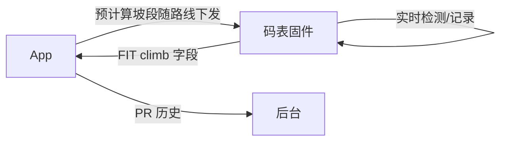
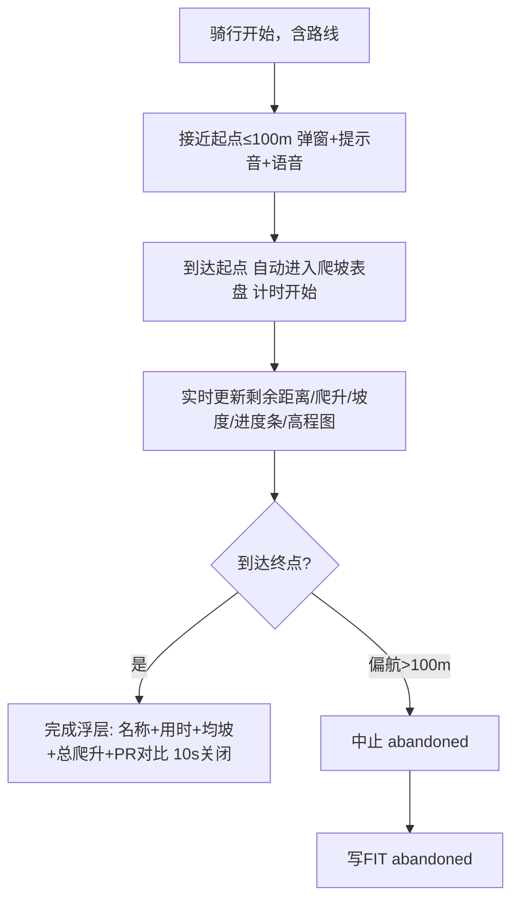
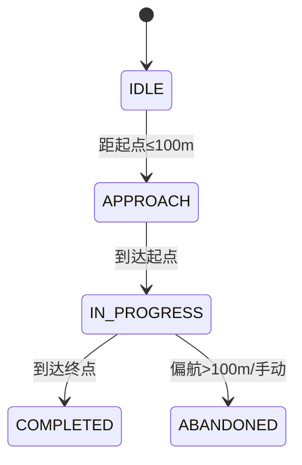

# 爬坡规划（ClimbPro）｜复杂/新功能 PRD

> 模板：`knowledge-base/00_规范与模板/PRD模板-复杂新功能.md` ｜ 事实源：整合PRD_V2 §3.7.6（benchmark）

## 0. 基本信息

| 需求名称 | 爬坡规划（ClimbPro） | 负责人/协作人 | @刘媛媛 |
|---|---|---|---|
| 需求来源 | 对标 Garmin ClimbPro；PV3.2 主线 | 适用产品/机型 | C716 Pro（全功能）/ C716（仅路线爬坡） |
| 目标版本 | PV3.2（码表端）/ PV3.3（语音完整实现） | 文档状态 | 评审中 |
| 最后更新 | 2026-08-14 | | |

## 1. 背景

- **用户/场景**：公路/爬坡训练用户（L2/L3）骑行前预览路线爬坡，骑行中掌握进度，骑行后复盘。
- **当前问题**：码表仅显示实时坡度，缺爬坡段整体预览与进度追踪。
- **需求依据**：benchmark §3.7.6；Garmin Edge ClimbPro 为行业标杆。

## 2. 目标

1. 基于路线高程自动识别爬坡段并分级（Cat4~HC + 短陡坡）。
2. 提供预览 → 进行中 → 完成总结 → App 分析全链路。
3. Free Ride（无路线）实时识别爬坡（本期）；附近坡段表盘（P1）。

## 3. 实现方案

| 层级 | 方案 |
|---|---|
| 硬件/物理层 | 气压计（1Hz）主高程；GNSS 双频校准兜底 |
| 固件/协议层 | 高程融合（5s 滑动窗口）；GNSS 每 5min 或精度<10m 校正；路线坡段 App 预计算随路线下发；Free Ride 码表本地实时计算；FIT climb 字段写入 |
| App 业务层 | 路线坡段预计算下发；骑行记录爬坡 ICON/详情/坡段分析；PR 历史数据 |

### 3.1 涉及端

| 端 | 负责 |
|---|---|
| 码表硬件/固件 | 高程融合、爬坡检测、进行中表盘、完成总结、FIT 写入 |
| OnelapFit App | 路线坡段预计算下发、爬坡分析、PR 存储 |
| 后台/云服务 | 坡段数据源（P1 待定：出厂内置/云端） |

### 3.2 端到端关系

## 4. 功能范围

| 范围 | 内容 |
|---|---|
| 产品端 | 码表 + App |
| 新增能力 | 爬坡检测分级、预览/进行中/完成/详情、Free Ride 实时识别、高程全览、App 爬坡分析、PR 对比 |
| 修改能力 | 表盘顺序（课程→团骑→导航→爬坡→赛段） |
| 复用能力 | 地图、导航、赛段语音模板、FIT 记录、气压计高程 |

## 5. 业务流程

### 5.1 主流程（路线骑）

### 5.2 状态变化（详见 01-需求分析 状态矩阵）

## 6. 功能说明

### 6.1 爬坡检测与分级

| 项目 | 内容 |
|---|---|
| 数据来源 | 路线高程（App 预计算）+ 气压计/GPS 实时比对 |
| 分类爬坡阈值 | **连续爬升≥30m 且坡长≥500m 且平均坡度≥3%**（结论先行：对标 Garmin） |
| 短陡坡阈值 | 坡长 300~500m 且均坡≥5%，或坡长<300m 但最大坡度≥8% |
| 高程滤波 | 5s 滑动窗口 |
| 单调判定 | 连续爬升段内允许局部≤5m 下跌 |
| GNSS 校正 | 每 5min 或定位精度<10m 校正一次 |

分级（颜色沿用 PV3.2）：Cat4 绿（30~150m）/ Cat3 浅蓝（150~300m）/ Cat2 黄（300~600m）/ Cat1 橙（600~900m）/ HC 红（>900m）/ 短陡坡 灰。

> ⚠️ 警告：气压计天气剧变漂移明显，必须 GNSS 周期校准，否则误判坡度。

### 6.2 爬坡预览表盘（有路线）

- 触发：骑行添加路线且路线含爬坡信息。
- 展示：剩余坡段总数/总距离/总爬升 + 未完成坡段列表（距离/爬升/均坡），进行中显示进度，完成后删除；至多 50 条。

### 6.3 爬坡进行中表盘（融合口径）

- 展示：**爬坡名称/等级 + 剩余距离 + 当前坡度（实时）+ 平均坡度 + 已爬升 + 剩余爬升 + 进度条（已骑/总距离，颜色随坡度区间变化）+ 海拔高程剖面图**。
- 计时：到达起点计时开始，骑行暂停不暂停计时（待确认统一口径）。
- 尺寸：不可编辑区域 2x3。

### 6.4 爬坡完成总结（benchmark + PR 对比口径）

- 触发：到达终点自动浮层。
- 内容：**爬坡名称 + 用时 + 平均坡度 + 总爬升 + 与历史最佳（PR）对比（若有）**。
- 关闭：倒计时 **10s** 自动关闭或点击关闭，自动退出爬坡表盘回原表盘页。

### 6.5 爬坡详情弹窗

- 长按地图爬坡 icon（约 0.5s）触发；含等级、距离（当前位置到起点）、方向、长度、爬升、平均坡度、高程图。
- 高程图颜色分档：绿<3% / 黄 3~6% / 橙 6~10% / 红>10%。
- 操作：【导航】【取消】；不支持收藏为位置点。

### 6.6 导航到爬坡起点

- 二次确认「是否导航到爬坡段起点？」。
- 到达起点 ≤50m 自动进入爬坡表盘。
- 优先级：路线内爬坡优先于单独导航到爬坡；位置点导航与爬坡导航互斥（后触发弹窗询问「是否切换」）。
- 未到达途径点前偏航：首次提示「您已偏离路线，请骑行至坡段起点」，再次偏航重新规划。

### 6.7 Free Ride 实时识别（本期）

- 无路线时基于实时高程滑动窗口检测，达到阈值触发。
- 弹窗「前方 X 米开始爬坡，平均坡度 Y%，长度 Z 米」+ 语音「即将开始爬坡」。
- 进入后自动切 Free Ride 爬坡表盘（当前坡度、已爬升、预估剩余距离，标注「估算」）。
- 结束判定：高程下降持续 10s。
- 数据写 FIT，标 climb_source=free_ride；不与 PR 对比。

> 附近坡段表盘（浏览 6km 内坡段、导航到起点）**P1 实现**，待坡段数据源（出厂内置/云端）决策。

### 6.8 高程全览

- 2x1 海拔剖面组件（导航且路线含高程时）：全程/10km 双档缩放，游标定位，偏航>100m 置灰，Y 轴最小刻度 50m，海拔显示≤60px，帧率≥25FPS。
- 路线详情页高程全览：≤100km 加载≤1s，150~300km≤2s，>300km≤3s。
- 国内/海外差异：海外在线创建/离线导航/偏航重规划均具备；国内基于路书。

### 6.9 App 爬坡分析

- 完成坡段爬升的 **40%** 才展示分析。
- 概览爬坡 ICON、详情爬坡卡片（序号/时间/距离/爬升/均坡/最大坡度）、坡段分析详情（含 VAM、标准化功率、功体比等）。
- 同起点多坡段：固件记录所有开始事件，App 仅展示最后结束的。

### 6.10 爬坡语音提示（PV3.3）

- 接近「即将进入爬坡」/ 开始「开始爬坡（可附加等级）」/ 完成「完成爬坡」。
- 声音优先级：实时对讲 > 语音提示 > 提示音 > 按键音。
- 仅 C706 及以上支持语音，其他机型短嘀一声。

## 7. 专业补充

### 7.1 设备与协议

| 设备 | 协议 | 说明 |
|---|---|---|
| 气压计/GNSS | 内部传感器 | 高程融合 |
| 坡段数据 | 随路线下发 | App 预计算，下发通道沿用现有路线方案 |

### 7.2 数据与持久化（FIT）

| 数据 | 用途 | 字段 |
|---|---|---|
| 爬坡完成 | 复盘/App 分析 | 起终点经纬度、爬升、平均坡度、用时 |
| Free Ride | 区分来源 | climb_source=free_ride |
| 爬坡中止 | 标记 | climb_event=abandoned |
| PR 历史 | 完成总结对比 | 待定存储位置 |

### 7.3 版本与兼容

| 项目 | 要求 |
|---|---|
| 支持机型 | C716 Pro（全功能）/ C716（仅路线爬坡）；C706 爬坡已有（1.6） |
| 国内/海外差异 | 高程全览路线来源规则不同；爬坡数据源海外可云端 |
| 新旧版本协同 | FIT climb 字段前后版本兼容（待研发定义） |

## 8. 验收与待确认

| 场景 | 操作 | 预期结果 |
|---|---|---|
| 接近坡段 | 距起点≤100m | 弹窗+提示音+语音 |
| 到达起点 | 自动进入 | 进行中表盘，计时开始 |
| 到达终点 | 自动浮层 | 名称+用时+均坡+总爬升+PR 对比，10s 关闭 |
| 偏航中止 | 偏航>100m | 写 FIT abandoned |
| Free Ride | 无路线骑坡 | 实时识别+弹窗+估剩余距离 |

| 待确认问题 | 负责人 | 结论 |
|---|---|---|
| climb_id 码表-App 一致性 | 固件 | 待确认 |
| 中止后重入规则 | 固件/产品 | 待确认 |
| 暂停计时口径 | 产品 | 待确认（建议：暂停不暂停计时，对标 Garmin） |
| GNSS 丢失偏航冻结 | 固件 | 待确认 |
| PR 数据存储位置与更新时机 | 产品/后台 | 待确认 |
| 附近坡段数据源（P1） | 产品/后台 | 待确认 |

## 9. 修订记录

| 版本 | 日期 | 修改人 | 修改内容 |
|---|---|---|---|
| v0.1 | 2026-08-14 | MFP 工作流 | 基于 benchmark §3.7.6 撰写，融合评审后 PM 决策的 4 处口径（完成总结 PR 对比 / 进行中表盘融合 / 检测阈值加≥30m / Free Ride 先实时后附近坡段） |
