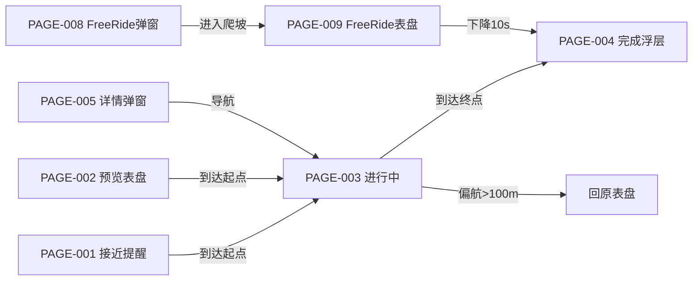

# 爬坡规划 Demo 版 PRD 与原型输入

> 模板：`knowledge-base/00_规范与模板/Demo版PRD与原型输入规范.md` ｜ 关联 PRD：`02-PRD.md`（v0.2）

## 1. 进入条件

- ✅ 正式 PRD（02-PRD.md v0.2）
- ✅ 目标端：迈金 C716 Pro / C706（码表端 320×480）+ OnelapFit App
- ✅ 状态矩阵（01-需求分析 §五）：IDLE / APPROACH / IN_PROGRESS / COMPLETED / ABANDONED
- ✅ 对象字段清单（01-需求分析 §四）：ClimbSegment / ClimbRecord / ClimbPR
- ✅ 适用机型：C716 Pro 全功能、C716 仅路线爬坡
- ✅ 设计系统：`knowledge-base/05_设计系统/02_迈金C706/`（码表）+ `01_顽鹿App/`（App）
- ⚠️ 附近坡段表盘/列表/详情（原 draft 3.5/3.6/3.7）为 **P1**，本期原型不含。

## 2. 页面清单

| 页面 ID | 页面名称 | 目标端 | 入口 | 关联需求 | 关联状态 | 页面类型 |
|---|---|---|---|---|---|---|
| PAGE-001 | 爬坡接近提醒弹窗 | 码表 | 距起点 ≤100m | §6.2 | APPROACH | 提醒 |
| PAGE-002 | 爬坡预览表盘 | 码表 | 骑行添加路线且含爬坡 | §6.2 | IDLE/APPROACH | 列表 |
| PAGE-003 | 爬坡进行中表盘 | 码表 | 到达起点自动进入（≤50m） | §6.3 | IN_PROGRESS | 进行中 |
| PAGE-004 | 爬坡完成总结浮层 | 码表 | 到达终点 | §6.4 | COMPLETED | 结果 |
| PAGE-005 | 爬坡详情弹窗 | 码表 | 地图大图长按 icon | §6.5 | IDLE | 详情 |
| PAGE-006 | 高程全览组件（2x1） | 码表 | 导航含高程数据 | §6.8 | — | 组件 |
| PAGE-007 | 路线详情页高程全览 | 码表 | 路线详情页下半部 | §6.8 | — | 详情 |
| PAGE-008 | Free Ride 爬坡弹窗 | 码表 | 实时检测到前方爬坡 | §6.7 | APPROACH | 提醒 |
| PAGE-009 | Free Ride 爬坡表盘 | 码表 | 进入爬坡自动切 | §6.7 | IN_PROGRESS | 进行中 |
| PAGE-010 | App 爬坡分析（概览/详情/坡段分析） | App | 骑行记录 | §6.9 | COMPLETED | 详情 |

## 3. 页面状态

| 页面 ID | 状态 | 进入条件 | 页面展示 | 退出/跳转 |
|---|---|---|---|---|
| PAGE-002 | 默认（有坡） | 路线含爬坡 | 剩余坡段总数/总距离/总爬升 + 列表 | 到达起点→PAGE-003 |
| PAGE-002 | 空态 | 路线无爬坡段 | 不展示预览表盘（或空态提示，待确认） | — |
| PAGE-003 | 默认 | 到达起点 | 名称/等级+剩余距离+坡度+已爬升+进度条+高程图 | 到终点→PAGE-004；偏航→中止 |
| PAGE-004 | 有 PR | 完成且有历史 | 名称+用时+均坡+总爬升+PR 对比 | 10s 自动关/点击关 |
| PAGE-004 | 无 PR | 完成首次 | 名称+用时+均坡+总爬升（无对比） | 同上 |
| PAGE-006 | 全程/10km | 点击切换档位 | 海拔曲线+填充+游标 | 偏航>100m 置灰锁游标 |
| PAGE-009 | 进行中 | 进入爬坡 | 当前坡度+已爬升+预估剩余(标注估算) | 高程下降 10s→结束 |

## 4. 页面内容与字段（关键页）

| 页面 | 区域/组件 | 字段/文案 | 数据来源 | 关联字段 |
|---|---|---|---|---|
| PAGE-003 | 顶部 | 爬坡名称/等级（Cat4~HC） | App 下发 | cat_level |
| PAGE-003 | 进度区 | 进度条（已骑/总距离，颜色随坡度区间） | 码表实时 | distance |
| PAGE-003 | 数据区 | 剩余距离/爬升、当前坡度、平均坡度、已爬升 | 实时计算 | elevation_gain/avg_grade |
| PAGE-003 | 高程图 | 海拔剖面（分难度颜色填充） | 高程序列 | elevation_series |
| PAGE-004 | 浮层 | 名称+用时+均坡+总爬升+PR 对比 | FIT/PR 本地 | ClimbPR |
| PAGE-005 | 详情区 | 等级/距离/方向/长度/爬升/均坡/高程图 | App 下发 | 各字段 |
| PAGE-005 | 操作区 | 【导航】【取消】 | — | — |
| PAGE-008 | 弹窗 | 「前方 X 米开始爬坡，平均坡度 Y%，长度 Z 米」 | 实时检测 | — |

## 5. 用户操作与反馈

| 操作 | 页面 | 入口 | 可操作条件 | 系统行为 | 成功反馈 | 下一页面 |
|---|---|---|---|---|---|---|
| ACT-01 导航到起点 | PAGE-005 | 导航按钮 | 非进行中 | 二次确认「是否导航到爬坡段起点？」 | 开始导航 | PAGE-003 |
| ACT-02 关闭详情 | PAGE-005 | 取消按钮 | 任意 | 关闭弹窗 | — | 地图 |
| ACT-03 切换高程档位 | PAGE-006 | 点击组件 | 有高程数据 | 全程↔10km 循环 | 「10KM」/「全程」提示 | — |
| ACT-04 关闭完成浮层 | PAGE-004 | 点击/超时 | 完成时 | 关闭浮层回原表盘 | — | 原表盘 |

## 6. 页面跳转

## 7. 端到端联动（App ↔ 码表）

| 步骤 | 用户看到的端 | 动作/反馈 | 另一端同步 |
|---|---|---|---|
| 1 | App | 规划路线，预计算爬坡段 | 随路线下发码表 |
| 2 | 码表 | 骑行中识别/追踪爬坡 | — |
| 3 | 码表 | 完成/中止，写 FIT | 同步 App |
| 4 | App | 爬坡分析展示、PR 更新 | PR 同步回码表 |

## 8. 原型约束

| 项目 | 要求 |
|---|---|
| 目标端 | 码表 C706/C716（320×480）+ OnelapFit App |
| 设计规范 | `knowledge-base/05_设计系统/02_迈金C706/`、`01_顽鹿App/` |
| 尺寸 | 码表 320×480，无滚动/裁切/底部伪操作栏 |
| 不允许自行假设 | 实体按键、协议、硬件能力、自动恢复、未确认页面（附近坡段） |
| 文案约束 | 短文案；状态不只依赖颜色；高程图颜色分档 绿<3%/黄3-6%/橙6-10%/红>10% |

## 9. 需求—页面追踪

| 需求 | 页面/状态/操作 | 验收 ID | 覆盖 |
|---|---|---|---|
| 检测分级 §6.1 | PAGE-003 cat_level / 高程图 | AC-01 | 是 |
| 预览 §6.2 | PAGE-002 | AC-02 | 是 |
| 进行中 §6.3 | PAGE-003 | AC-03 | 是 |
| 完成总结 §6.4 | PAGE-004 | AC-04 | 是 |
| 详情弹窗 §6.5 | PAGE-005 | AC-05 | 是 |
| 导航到起点 §6.6 | PAGE-005→ACT-01 | AC-06 | 是 |
| Free Ride §6.7 | PAGE-008/009 | AC-07 | 是 |
| 高程全览 §6.8 | PAGE-006/007 | AC-08 | 是 |
| App 分析 §6.9 | PAGE-010 | AC-09 | 是 |
| 附近坡段（P1） | — | — | 否（P1） |

## 10. 生成前检查

- [x] 目标端和页面范围明确（码表 8 页 + App 1 页，附近坡段 P1 不含）
- [x] 每个页面有入口和退出/跳转
- [x] 页面有默认状态和必要异常状态（空态/无 PR）
- [x] 字段都有数据来源（App 下发 / 实时计算 / FIT / PR 本地）
- [x] 操作有可执行条件和结果
- [ ] 设计尺寸/组件/文案约束已指定（320×480 + C706 设计系统）— 待 magene-design 路由产出
- [x] 页面可追溯到需求 ID

> 下一步：`magene-design` 设计路由（target=magene-c706）→ `figma-lofi-prototype` 出低保真流程图；原型验收用 `原型验收清单.md` 反查。
